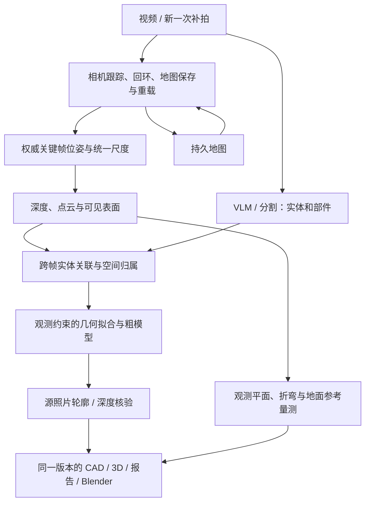

# 视频到完整可编辑空间实施计划

> **For agentic workers:** 使用 superpowers:subagent-driven-development 或 superpowers:executing-plans 逐阶段实施；勾选项只有在对应证据存在时才能完成。

**Goal:** 上传移动摄像头视频后，在一个可复用坐标系中重建区域、通道、结构和物体，生成按实体/部件编辑的粗模型，并在照片、CAD、浏览器 3D 与自动测量之间保持对应。目标为通用空间重建。按用户 2026-09-17 最新决定，先复现公开室内场景，再换入家庭视频，工厂作为后续场景。

**Architecture:** 一个 SLAM 后端负责全局坐标、回环和跨次地图；深度重建与 VLM 在该坐标系下提供观测和部件结构；几何拟合、建模、验证、报告沿用现有 platform 契约。照片和视频进入同一生产处理链，不新增资产平台或并行的对象清单。

**Tech Stack:** 首个技术验证用 ORB-SLAM3 单目/Atlas；随后验证现有 MapAnything 的稠密几何接入；复用现有 VLM/分割、OpenCV、Open3D、trimesh、Blender、platform 存储与报告。

日期：2026-09-17。状态：Phase 2 已启动，公开室内 RGB-D 对照及 RGB 8/32 帧实验已实际执行，完整空间质量尚未通过，见 [实验记录](../phase2/README.md)。这些实验不替代下列连续地图与跨次重定位验收；产品视频上传尚未修改。

**当前执行顺序已由[统一技术路线](../phase2/TECHNICAL-ROADMAP.md)的 M0–M5 统领。** 本文件保留静态重建、建模及上传明细；新的时间回放、动态身份和人体模型要求以主路线为准。Atlas 重载后的活动图/合并以及原版未消费动态 mask 的具体限制，也在主路线中记录，不能把原版安装成功当作动态地图完成。

研究和源码依据见[研究报告](../research/2026-09-17-factory-video-spatial-memory.md)。本计划收敛其首轮选型：普通 RGB 视频先验证原生单目地图复用，不直接将不同 MapAnything 窗口的预测位姿输入 RTAB-Map。

## 第一版交付边界

- 底层面向住宅、办公室、商店、仓库、工厂等空间，后续以室外场景独立验证适用范围；不把工厂名称或固定设备类别写成建图、分割和几何的前提。EHS 属于工厂应用，通用重建不依赖 EHS 规则或原始 CAD 存在。
- 上传原始视频，后台离线处理，报告读取保存结果。首次用公开室内记录验证几何重建，再用用户家庭视频验证真实输入；多区域验收仍需覆盖两个相邻区域及其间通道。
- 模型允许简化，但实体、关键部件、空间位置、主要形状和来源不能丢失。板件真实折弯不能被替换成一个包围盒。
- 同一视频返回旧区域、下一段视频重新进入旧区域，都要复用同一地图和实体身份。
- 视频应覆盖侧面和转角并保留连续路径；首轮样本使用固定镜头和匹配分辨率的相机标定。物理尺度使用明确的实测/来源 CAD 参考；不能默认相机高 1.5 米。
- 第一版测量显示估计值及证据状态。新增照片改善观测时，更新模型和测量；生成的隐藏表面不能作为独立现场验证证据。

## 关键架构决定



1. **地图只有一个全局优化者。** ORB-SLAM3 单目回环和 Atlas 保存/加载适合首个普通 RGB 验证。MapAnything 的输入位姿是条件输入，不能假设输出相机严格不变；接入时必须核验并沿用权威地图位姿。单目统一尺度不自动等于米。[ORB-SLAM3](https://github.com/UZ-SLAMLab/ORB_SLAM3)、[Atlas 实现](https://github.com/UZ-SLAMLab/ORB_SLAM3/blob/master/src/System.cc)、[MapAnything 输入契约](https://github.com/facebookresearch/map-anything#inference-with-any-geometric-inputs)。
2. **暂不把预测 RGB-D 与 RTAB-Map 拼成生产主干。** RTAB-Map 需要连续里程计、相机和一致尺度深度；不同局部窗口的独立尺度不由其已核查的 SE3 图优化自动解决。这是接口缺口，不能用数据库可保存来替代验证。[输入](https://github.com/introlab/rtabmap/blob/master/corelib/include/rtabmap/core/Rtabmap.h)、[优化实现](https://github.com/introlab/rtabmap/blob/master/corelib/src/optimizer/OptimizerG2O.cpp)。
3. **语义选择结构，几何约束参数。** VLM 查看原图、分割及几何摘要，输出部件构成与证据引用；位置、方向、面边界及连接由对应观测拟合。规则板、杆、框架按几何构成建模；复杂设备使用其观测表面与有依据的粗部件。它们是明确的建模方式，不按失败状态偷偷换一个模型。
4. **范围是整个目标空间。** 当前工位之外可能是本次要重建的通道或工位 B，不能沿用“离开 A 就删除”的筛选。范围复核依据本次采集目标，保留跨区实体与边界证据。
5. **许可与运行能力分开记录。** ORB-SLAM3 公开版为 GPLv3；当前选择是技术实验，不表示已经决定闭源产品分发方式。投入生产前核对实际部署/分发及依赖许可，不为此创建另一套运行算法。

## 执行起点：先交付可累计、可回放的对象地图

此步骤与阶段 1 的视频定位验证可并行。直接使用已有确认身份、共享坐标的照片、mask、点图和相机；不是重新运行所有生成模型，也不将照片回放当成视频定位验收。

- [ ] 复用 `observationRefs` 与现有跨视角深度检查，提取各实体所属的有效三维点；用已安装 Open3D 做对象内的空间去重，保存颜色、独立来源及支持统计。累计对象几何与每张原始观察同时保留。
- [ ] 以源观察及输入 hash 去重，重复加入同一观察不改变几何或支持次数；采样、体素大小和坐标单位明确写入版本，不能用固定米制阈值处理未标定空间。
- [ ] 采用一个固定版本的视觉编码器为对象区域计算特征，以原图、mask、裁剪方式、编码器版本缓存；实体聚合其有效观察特征。复用现有几何身份依据，新增语义相似度只参与匹配证据，不能仅凭类别相同合并对象。
- [ ] 在现有实体上保存几何来源和对象关系；明确区分几何可计算的关系与 VLM 提议的语义关系。身份拆分或几何更新时，从仍有效的原始观察重建受影响实体及关系。
- [ ] 用同一组真实来源检查三件事：重复输入无增量；逐步加入与从有效来源重新生成的结果一致；新增视角补全目标而不吞并相邻对象。随后对全部源照片做轮廓和深度核验，在报告中展示每次补充的来源。

首个交付产物是“同一实体随观测增加而补全、可重载继续累计”的对象地图，及上述可运行检查。几何累计、特征聚合、索引和回放可以在 CPU 上执行；新的视觉特征提取需要编码器推理，GPU/API 调用仅在缓存没有对应有效结果时执行。完整可编辑模型仍由阶段 4 交付。

## 阶段 1：证明视频空间记忆

**输入：** 同一相机的两次独立视频：A→通道→B→A；第二次从 B 开始返回 A。保留时间戳、原文件 hash、相机参数和不参与拟合的复核照片。

- [ ] 先运行单目建图，记录逐帧跟踪、关键帧、失跟、回环与地图关系。
- [ ] 保存 Atlas，结束进程；另起进程重载，输入第二段。不得手填 B 初始位姿，也不得事后分别对齐两段轨迹来伪装重定位。
- [ ] 检查第二段关联到旧地图的实际匹配及几何证据，返回 A 后只有一套空间；同款设备不能成为独立的关联依据。
- [ ] 再对最终关键帧调用现有深度模型；核验原图/深度/K/位姿像素域一致，跨窗口表面连续，深度尺度与地图一致。位姿条件推理没有通过该检查时，不进入建模验收。
- [ ] 保存重载证据、回环前后误差、窗口交界误差、阶段计时及资源记录。是否具有物理尺度另以独立参考验收。

**通过条件：** 两次拍摄形成可复用的共同地图，稠密观测可放入该地图；没有未解释的独立坐标或尺度跳变。本阶段尚不验收模型完整度。

## 阶段 2：统一真实上传入口和保存契约

**代码落点：** `ehs_spatial/report_workspace.py`、`modal_apps/report_workspace_app.py`、`ehs_spatial/contracts.py`、`ehs_spatial/platform/reconstruction.py`。复用 `ehs_spatial/video.py` 的解码能力，固定机位轨迹分析不进入新建图流程。

- [ ] 在现用 `POST /api/reports → DurableUploads → process_upload` 接入视频，校验文件、可解码内容、来源路径及采集元数据。
- [ ] 分开采集长度与模型批量上限。同时检查 HTTP、`CaptureRun`、MapAnything adapter、Gemini review 与 platform `_capture` 的四图约束；批量边界不能切断全局场景。
- [ ] 使现用任务实际调用 platform 的实体/资产/观测处理链，并接通其已有 repository、blob、job 服务；不能只改一个未启用的独立 worker。
- [ ] 原视频、原帧索引、时间戳、相机与像素变换、地图 artifact、geometry revision 保存到现有存储。照片和视频使用同一 `coordinateFrames/cameras/observations/entities/assets` 结果源。

**通过条件：** 从用户实际入口上传两次视频即可生成阶段 1 的相同证据；重启服务后仍可读取并继续处理同一地图。对已有照片入口做对应回归。

## 阶段 3：建立整空间实体与部件清单

**代码落点：** 复用 `platform/reconstruction.py`、`spatial.py`、`identity.py` 的观测归属、配准与身份关系。

- [ ] 先用原视频和复核照片列出 A、通道、B 的实体及关键部件，冻结首轮验收分母；自动发现结果与该清单逐项对照。
- [ ] VLM/分割针对有覆盖价值的关键帧执行；关联使用世界位置、跨帧投影、遮挡、外观与邻接关系，同名设备不直接合并。
- [ ] 范围复核以整段目标空间为对象；对外部背景、边界不清及漏观测分别保存结果，不能为了完成率删除缺失项。
- [ ] 物体离开画面时保留；物体真实移动时记录时间/状态，不把多个位置融合成静态设备。

**通过条件：** 复访保留同一物体身份；两个相似工位保持各自实体；模型还未生成的实体仍出现在完整清单中。

## 阶段 4：点云与 VLM 约束下的可编辑建模

**代码落点：** 扩展 `platform/coarse_model.py` 的几何建模范围；复用 `model_quality.py`、`blender_export.py`。现有两视角细长框架只是一个已有实现，不等于通用建模已经完成。

- [ ] 对实体的所属观测提取位置、占地、轴线、平面、边界和接合关系；VLM 提供部件结构及源图引用。
- [ ] 围栏生成分别可编辑的立柱、横梁和面板；折板用两个观测支持的面及共享边构造；设备粗部件保留主要体量、朝向、支撑位置和必要间隙。没有观测的厚度、背面和重复细节明确保存为假设。
- [ ] 对连续观测表面使用已安装 Open3D 的深度融合/网格能力；薄板、网孔和透明面检查其所属支持，不能让融合平滑把间隙填实或把背景当面板。
- [ ] 输出已有契约要求的 `mesh + objectToNative + provenance`，复用 `_assess_generation` 核验所有可用源图的轮廓及深度，并检查相邻设备和通道关系。
- [ ] 回环或新照片改变相机后，重建受影响几何，重新对齐模型并使旧质量证据失效。只有当前 revision 的结果可显示为当前模型。

**通过条件：** 清单中每个待交付实体及关键部件有可编辑几何、可追溯位置和核验结果；缺项仍列为缺项。不能用一个围栏的几十根杆替代几十个现场实体的完成数量。

## 阶段 5：自动测量、CAD 与报告交付

**代码落点：** 复用 `platform/planar_surfaces.py`、`scene_measurements.py`、`source_cad.py`、`correspondence.py`、`publication_site.py` 及现有报告/3D 前端。

- [ ] 在处理阶段扫描具有足够观测支持的平面与相接面；分别计算地面倾角、同一板件的折弯内角，以及已要求的距离等。地面参考来自观测，不能把任意世界 Z 当竖直；缺测显示原因，不显示为 0。
- [ ] 保存参与测角的两个面、共享边、来源、算法版本和结果。报告开关只控制显示；不要求用户逐项点击才开始分析。
- [ ] 来源 CAD 有匹配依据时参与平面布局/尺度约束；原图保持完整。模型投影随同 geometry revision 更新，来源 CAD 与投影结果各自保留来源；二维 CAD 不证明未提供的高度和折角。
- [ ] 从同一保存 revision 输出 `.blend`、`.glb`、CAD 投影、测量和报告。照片→CAD→场景→部件选择始终使用同一实体关系。
- [ ] 报告先加载正文及轻量场景资源；模型按需加载，完整编辑历史延迟加载。浏览器读取不得触发模型分析，旋转与选中不得等待批处理。

**通过条件：** 用户从真实报告入口即可浏览整场景、选择每个实体、展开部件并查看已计算角度；Blender 导出只是交付项之一，不能代替网页验收。

## 全链路验收与计量

| 验收项 | 证据与失败判据 |
|---|---|
| 空间连续与跨次记忆 | A/B/通道同坐标，保存重载后通过真实匹配关联；重复地图或手工定位不通过 |
| 实体与部件完整 | 固定清单逐项照片、模型、CAD 双向选中；漏项/错并/靠删除分母完成均不通过 |
| 位置与形状 | 留出的复核照片、实测点距/尺寸与空间关系；只对自身输入自洽不算独立位置验证 |
| 折弯与倾角 | 包含真实非直角板件；检查两个面、共享边和内角，明确区分倾角、法线锐角、补角 |
| 版本一致 | 回环/补拍后 CAD、模型、测量和质量证据共同更新；混用旧坐标不通过 |
| 实际报告可用 | 实测首次可交互、资源传输、旋转帧时、对象切换和内存；页面卡死不通过 |

误差数值、视频处理时间和费用先在阶段 1 的固定样本实测。物理位置/角度容差须在评估前根据用途与参考测量精度冻结，不能看完输出再放宽，也不能预先宣称任意工厂的精度或处理时长。

现有回归入口（实施时按实际改动选用；通过这些检查不代替真实视频验收）：

```sh
.venv/bin/python -m pytest tests/test_capture_pipeline.py tests/test_platform_spatial.py tests/test_platform_identity.py tests/test_coarse_model.py tests/test_platform_model_quality.py tests/test_platform_quality_binding.py tests/test_platform_publications.py
```

每个新增非平凡行为至少留下一个可运行检查，重点覆盖坐标/尺度错误、身份错并、几何更新后旧测量失效和实际报告读取。新视频实验和逐实体验收的产物统一从本文件及算法总表链接，不在研究结论中宣称上线。

## 通用性、空间记忆与资源规模

架构不限定场所，准确率仍需按输入验证：白墙缺少特征、玻璃和镜面深度混淆、重复结构误关联、动态物体及室外植被都可能影响结果。工厂样本通过后，增加独立房间/办公室样本检查是否隐含工业类别或尺寸假设；室外样本单独报告，不能从室内结果推定。

长期记忆保存地图关键帧、视觉特征、相机、约束关系、物体身份及来源；观测图像、深度、点云/网格是其证据与几何资产。它不是把原视频逐帧塞进一次 VLM 调用。运行时限定活动地图、深度推理窗口和语义请求，旧区域通过地点检索取回；浏览器只读取所需模型。地图管理、GPU 推理和浏览器资源分别设限，不能认为一个缓存参数同时控制三者。全局优化的规模仍会随地图扩大。

[RTAB-Map 记忆管理](https://github.com/introlab/rtabmap/blob/master/doxygen/mainpage.md)提供短期/工作/长期记忆及数据库取回参考，其相关限制需显式配置，并非默认无限扩展。[ConceptGraphs](https://concept-graphs.github.io/)将多视角 RGB-D 的分割与语义关联为对象和关系；这种对象级记忆也不自动产生可编辑部件模型。

以下为作者公开配置的资源数据，不是本项目视频到模型的端到端实测：

| 方法 | 公开测量 | 口径 |
|---|---|---|
| DA3-Streaming | 室内 TUM，504×378，chunk 30–120：峰值显存 18.7–28.3 GB | 重叠为半个 chunk；更小窗口也改变误差。另在 KITTI 11,373 帧上，A100 用时 22分17秒、8.51 FPS，排除预热、加载和 PLY 保存。[官方表](https://github.com/ByteDance-Seed/Depth-Anything-3/blob/main/da3_streaming/README.md#experiment-results) |
| MASt3R-SLAM | 4090＋i9-12900K，长边 512，约 15 FPS | 论文跟踪/重建设置；不是分割、部件生成及报告总耗时。[论文](https://arxiv.org/html/2412.12392v2#S4) |

存储的可复算示例：假设 10 分钟、30 FPS 原视频共 18,000 帧，选择其中 600 个几何关键帧，每帧 504×378。仅 float32 深度为 `600×504×378×4 = 457,228,800` 字节（约 457 MB）；若逐帧存每像素 float32 XYZ＋uint8 RGB，则为 `600×504×378×15 = 1,714,608,000` 字节（约 1.71 GB）。这两种资产若同时保留，开销相加；置信度、特征、纹理、原视频、索引及运行临时数据另计。融合/压缩会改变结果，不能用这些数字冒充峰值 RAM 或显存。

同样，假设 1,000 个物体每个保存 768 维 float32 语义向量，向量本体约 3.07 MB，不含其点云、照片和元数据。空间面积本身不决定容量；覆盖、细节分辨率、关键帧数量与保留版本数才是预算依据。600 帧仅为计算示例，实际抽帧依据视差、清晰度、重叠和新覆盖确定，不能固定每秒一帧而漏掉转角或薄部件。

### 首轮算力与费用预算方式

首个已配准照片回放先复用缓存的几何、分割与来源，在本地 CPU 测融合耗时和峰值内存。新的视频深度/分割/特征任务，建议以单张 48 GB L40S、32–64 GB 主机内存作为首轮压测配置；这是留有余量的测试配置，不是实测最低需求或任意视频的容量承诺。模型按阶段运行、地图分块载入，避免让所有模型、所有帧及整个地图同时驻留显存。首轮无需训练新的基础模型。

2026-09-17 查到 Modal 普通 GPU Tasks 的 L40S 基础价为 `$0.000542/秒`，即 `$1.9512/小时`。若实际 GPU 占用 30 分钟，该项为 `$0.9756`；此处只做计费换算，不声称某段视频可在 30 分钟内完成。CPU、内存、存储、模型 API、重复尝试及所选特殊运行选项另计。[官方价格](https://modal.com/pricing)、[GPU 配置](https://modal.com/docs/guide/gpu)。

阶段产物必须保存实际 GPU 秒数、CPU/内存用量、模型调用账目、输入数量和缓存命中，才可得到每段视频总价。本次只核查价格并规划资源，没有启动新付费任务。
