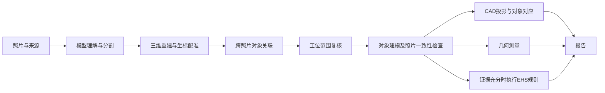

# 算法与分析流程总表

这是 Panoptes Platform 当前照片 → 对象 → CAD / 模型 → 测量 → 报告的统一入口。
维护日期：2026-09-18；照片代码基线包含 `f790127`，局部面实现版本为 `local-planar-inclinations-v2`，见下方验收记录。视频新增路线与照片已实现状态分别记录。
根 README 中四张照片、七种固定标签的说明属于早期 MVP，不代表当前 Platform 的完整流程。

研究扩展：[工厂视频重建、A→B→A 空间记忆与可编辑场景](../research/2026-09-17-factory-video-spatial-memory.md)（2026-09-17）。该文保留研究当时状态；后续859帧动态视频、RGB-D模型与有限跨进程地图复用的实际结果，以本页V01–V11和[MVP记录](../phase2/VIDEO-MVP.md)为准。

**当前 Phase 2 主路线：[视频、空间记忆、动态实体与分析模型](../phase2/TECHNICAL-ROADMAP.md)。** 统一记录他人架构、特征、算法/工程/训练分工、已有证据及 M0–M5 验收；包含第一视角时间回放、t=0/t=4 同一人车关联、骨架、模型和照片分析复用。第一版不训练新模型。

[静态空间建模实施明细](2026-09-17-video-full-scene-plan.md)保留原有几何和上传细节，执行顺序以主路线为准。执行与结果见 [Phase 2 实验记录](../phase2/README.md)，未通过的阶段不计入已实现条目。

动态扩展：[运动定义、地图记忆与时序模型](../phase2/DYNAMIC-SCENE.md)；[人体骨骼、模型与世界运动研究](../phase2/HUMAN-MOTION-RESEARCH.md)。实际视频、骨架、持久地图实验见 [MVP 执行记录](../phase2/VIDEO-MVP.md)，不能从方案或旧二维框跟踪推断验收。

## 使用与维护规则

- 本表记录代码实际行为；实施计划不等于功能已上线。
- 每个算法必须说明：目的、输入及坐标/单位、方法、关键参数与来源、输出、拒绝条件、局限、代码入口、验证证据、运行阶段/发布状态。
- 参数分成数学定义、工程阈值、产品筛选条件和政策规则。工程阈值不是准确率，不是法规。
- 输出应区分：已测量、没有可靠候选、缺输入、计算失败、尚未处理。不得将后四者归为“没有风险”或“没有该几何”。
- 算法或参数改变，应更新版本和输入指纹，重算受影响结果，同时更新此表；报告读取不得触发整批重建。
- 本目录是说明入口，代码仍是运行参数的唯一执行来源；不另建配置服务或算法注册系统。
- 新流程在这里登记；专项设计、实施计划和验收证据从这里链接，避免散落的计划被误认成现状。

## 流程总览

这是依赖关系图，任务会按变更范围重跑，并非所有任务都会执行每一个阶段。

## 已核对的算法登记

共 12 个功能条目；这是当前主链路的功能分类，不是全仓库算法函数总数。

| ID | 功能 | 方法类型 | 代码入口 | 当前状态 |
|---|---|---|---|---|
| A01 | 图片理解、对象分割 | 模型推断＋输出校验 | `reconstruction.py::run_segmentation`、provider manifest | 已实现；供应商/模型按任务记录，不能用旧 README 推定 |
| A02 | 三维输入、坐标配准 | 模型输出＋确定性几何 | `spatial.py::register_reference`、`registered_frame` | 已实现 |
| A03 | 跨照片对象关联 | 重投影＋阈值＋已确认关系 | `spatial.py::associate_observations` | 已实现；不保证全部身份已核实 |
| A04 | 地面参考估计 | 语义地面证据＋RANSAC | `spatial.py::estimate_native_ground` | 已实现；证据不足时没有地面参考 |
| A05 | 工位内外 sanity check | 多图模型复核＋规则校验 | `reconstruction.py::_review_workcell_scope`、`_admit_workcell_scope` | 已实现；unknown 不强制排除 |
| A06 | 对象模型生成与粗模型 | 生成模型＋受证据约束几何 | `reconstruction.py::run_generation`、`coarse_model.py`、`recgen.py` | 已实现多条生成路径；不等于实测模型 |
| A07 | 模型—照片一致性、姿态优化 | 光线投射＋数值评分与优化 | `model_quality.py::assess_model`、`refine_model_pose` | 已实现；质量状态与位置确认分别保留 |
| A08 | CAD 与照片/模型对应 | 投影几何＋来源关联 | `reconstruction.py::_refresh_plan_projections`、`source_cad.py`、`correspondence.py`、`web/src/CadView.tsx` | 已实现；来源 CAD 与模型投影是不同证据 |
| A09 | 板件自身折弯 | 两个主要平面＋共享边检查 | `scene_measurements.py::fitted_bend` | v2 已发布，仍只检出一处主要折弯 |
| A10 | 地面倾角、两面角、距离、区域占用、选点角 | 确定性几何计算 | `planar_surfaces.py`、`scene_measurements.py::measure_scene`、`web/src/SpatialMeasurements.tsx` | 交互测量＋多局部面倾角自动批处理已实现 |
| A11 | 分析持久化与报告读取 | 输入指纹、缓存、不可变来源 | `scene_measurements.py::analyze_bends`、`analyze_inclinations`、`publication_site.py` | 折弯和倾角批处理已接入；公共报告与独立 worker 发布分别记录 |
| A12 | EHS 规则判定 | 证据适用性＋配置规则＋数值计算 | `policy_engine.py`、`policy_service.py` | 已实现规则路径；当前示例版本尚无新安全评估 |

上表 Python 文件均在 `ehs_spatial/platform/`，除明确标出的前端文件。

### Phase 2 新增算法与工程链（本地实验，未替代照片服务）

| ID | 输入 → 方法 → 输出 | 代码与实际证据 | 当前质量边界 |
|---|---|---|---|
| V01 | 公开视频/逐帧来源 → 实际解码 PTS、SHA 和像素域校验 → 时间区间 | `scripts/build_video_pose_preview.py::source_spans`；严格逐帧的 walking/room 新源视频 | 旧 room 预览曾重采样，已保留原件并另产一帧一图版本；当前入口验证 CFR，不猜 VFR 末帧时长 |
| V02 | SAM3 周期独立发现 → SAM2.1 原生 video memory → 同帧唯一 IoU 关联 / 短轨迹 / RLE | `scripts/run_discovered_video.py`；859帧、29窗、9个短期ID；严重双人mask重合帧54→0；455.5秒、峰值RSS1.33GB | 9条轨迹不是9个人；81帧无mask，仍保留缺口。Mac状态offload导致单人空mask已用同输入CPU对照定位并修复；失败001保留 |
| V03 | 标定 RGB 或明确的 RGB-D + 动态mask → ORB-SLAM3 → 最终 Atlas / 相机 / 稀疏点 | `scripts/phase2_camera_build.py`、`phase2_camera_run.py`、`phase2_camera_export.py`；新版mask下827个RGB-D位姿，固定尺度ATE 0.01531m；A/B跨进程旧地图点复用有独立证据 | 未遮罩对照ATE 0.861m；测量是相机轨迹误差，不是物体/人体精度。单目房间质量另评，不能以state=OK代替几何精度 |
| V04 | 人员 mask + RGB → 预训练 RTMPose COCO17 → 帧内二维骨架 | `scripts/build_video_pose_preview.py`；新版859帧、1225个非空人员观测，31.87秒；原始分数、RGB输入和模型SHA留档 | 0.3是显示阈值，不是正确概率；出画ID单列absent，不作为当前位置或假骨架 |
| V05 | 同一最终地图位姿 + 传感器深度 + mask/2D骨架 → TSDF / 可见表面关节 | `scripts/build_replay_scene.py`；复用 `reconstruct_room_rgb.py::integrate`；748帧静态表面融合，22.69秒 | 需要传感器深度；没有动态mask的帧不融合，以免把漏检人焊进背景。遮挡关节不补齐；输出不等于完整人体形状 |
| V06 | 相同媒体时间的来源/观测/相机/模型 → 懒加载回放 | `web/experiments/video-mvp/`；复用原生 WebGL viewer 与 GLB reader | 空档不沿用旧位置，静态大资产不逐帧重载；完整 CAD/EHS 时序服务仍未接通 |
| V07 | SAM3独立人员裁剪 → 官方预训练OSNet-AIN → 历史外观竞争 + 双次确认 → 重现候选 | `scripts/person_reid.py`、`link_person_tracklets.py`；43检测、3.23秒；新版2条候选3→1、6→0，源图一致 | 不改native ID、不当永久身份；弱遮挡样本保留unknown；阈值尚未经陌生人负样本集标定 |
| V08 | 对象mask + 同域深度/相机 → 相邻像素三角化 → 独立对象GLB + 已有照片VLM核验 | `scripts/build_video_object_models.py`、`review_video_object_semantics.py`；6份可选择可见表面，VLM识别一处桌子/柜体误分类 | 6份观测不是6个已去重实体；只建可见表面。VLM复用绑定源图与mask overlay哈希，后续是否移动未知 |
| V09 | 同一米制地图中的连续躯干参考点 → 两个稳健窗口 → 位移/平均速度 | `scripts/video_motion.py`；复用V05结果，保留源帧与固定分辨率策略 | 仅表面躯干位移估计，不是步态、人体重心或EHS判定；缺观测/换参考点重置，低于分辨率不等于静止 |
| V10 | 标定RGB → 官方预训练DROID-SLAM特征/相关体与几何优化 → 原生相机/深度 → 支持过滤/TSDF | `modal_apps/droid_room.py`、`scripts/build_droid_replay.py`；002修正BA后学习上采样，1362帧/177关键帧，117.15秒、峰值3.90GB；全片Sim3 ATE 0.040824m | GT只用于评估、尺度未标定、完整相机含motion-only补全；3,398,400原点保留，20,124面仍有423个分量，未通过完整房间质量。独立对照没有Atlas重载 |
| V11 | 现有DROID关键帧/K/相机 → MapAnything相机条件输入 → 原生预测及合同检查 | `scripts/reconstruct_room_with_camera.py`；8视图实际探针及独立输入检查，`runs/droid-mapanything-probe-001/` | 模型重新预测相机，K与输入明显偏离；拒绝作为固定相机稠密深度融合。没有把诊断网格发布为已配准场景 |

V02的非人物实际对照：`scripts/run_seeded_video.py`复用已有SAM3 `car` 缓存，逐像素来源核对后追踪MEVA原视频440帧的5车；761.45秒/峰值RSS6.535GB，2200次非空观测、0个mask交叠。固定镜头下慢速倒车的SUV保留短期ID；没有新目标发现、重入或车辆三维模型证据。V04仅对精确`person`标签执行，车辆不输出人体骨架。保留失败发现尝试和原缓存回执缺失状态，详见MVP记录。

这些条目分别记录感知算法、坐标估计与工程连接，不另造算法注册服务；参数以对应代码和每次 `run.json` 为准。原始失败、无 mask、身份冲突、未合并地图与未校准状态都必须保留。

### A01 图片理解与分割

输入：照片资产、任务配置、选定 provider；输出：对象候选、像素 mask、来源/调用证据。
模型负责语义与图像推断；代码校验资产、像素域、对象归属等结构。模型版本取任务 manifest，不能以固定类别列表代替。
缺失/无效输出保留失败，不自行补造 mask。遮挡、透明表面和背景混入会影响后续几何。
验证入口：`tests/test_platform_reconstruction.py`、`tests/test_reconstruction_pipeline.py`。

**SAM 能力保留与扩展（更新至2026-09-18）：** 已有 `modal_apps/sam3_app.py`、`ehs_spatial/providers/sam3.py` 和 `serving/sam3_service.py` 的图片分割、RLE 编解码及已有调用/资产全部保留，并实际复用在V02、V07和V08。当前完整视频使用SAM3周期发现与SAM2.1窗口传播；SAM3/3.1原生视频入口已实现，但权重访问403，未执行GPU推理。fal SAM3.1视频接口已实测，返回类别并集且没有原生实例ID，不能当作完整多对象跟踪通过。相关入口与原始结果继续保留，不把“尚未通过某个视频端点”写成“没有SAM3”。骨架、三维地图、跨视频实体身份由独立环节提供证据。具体选型与实验链接见[主路线](../phase2/TECHNICAL-ROADMAP.md)和[实验记录](../phase2/VIDEO-MVP.md)。

### A02 三维输入与配准

输入：深度/三维点、相机、明确的裁剪缩放映射、背景对应像素；输出：统一坐标变换及配准证据。
`register_reference` 使用有界 RANSAC，默认相对容差 0.02；要求至少 64 个独立支持像素、至少 4 个空间区块。
深度坐标、相机深度和对象局部坐标不能混用；原生尺度不自动转为米。
缺背景支持、退化几何或像素映射不成立时拒绝配准。参数为工程配置。
验证：`tests/test_platform_spatial.py` 的 `register_reference` 用例及 `tests/test_platform_reconstruction.py`。

### A03 跨图关联

输入：mask、相机与同坐标点云、已确认/禁止关联；输出：候选对分数、证据与被接受的关联组。
双向重投影检查深度一致和 mask 包含度，处理遮挡，独立像素计数避免重复采样制造证据。
当前 `AssociationConfig`：支持像素 32、包含比例 0.65、相对深度容差 0.03、最佳差距 0.15、深度一致比例 0.65。
这些是工程阈值。少视角、遮挡、竞争分割可能保留独立记录；名称相同不构成合并证据。
验证：`tests/test_platform_identity.py`、`tests/test_platform_reconstruction.py`。

### A04 地面

输入：明确的地面 mask、多视图三维点和同一坐标系；输出：地面法向、平面与拟合证据。
当前配置：每视图至少 200 点；有多图时至少 2 图；距离阈值为尺度的 0.005；内点比例 0.75；跨视图法向差不超过 5°。
仅用于有来源证据的地面，不把世界 Z 轴直接当作现场竖直方向。
无地面证据、坐标未配准、点分布退化或视图冲突时返回证据不足。
验证：`tests/test_platform_spatial.py` 的地面测试与 `tests/check_scene_measurements.py` 的任意地面法向/缺失地面用例。

### A05 工位范围

输入：当前对象完整清单、每条观察所对应照片、冻结输入指纹；输出：inside / outside / unknown 及边界证据。
`workcell-scope-v2` 调用 model_review，再校验全清单覆盖和每条观察归属。
排除要求目标工位已建立、观察齐全、所有视图均 outside，且有可见边界证据；内部/未知子部件会阻止整组排除。
不按离原点远近或对象大小直接删除。模型可能误识别边界，因此保存原始证据与 unknown。
验证：`tests/test_platform_reconstruction.py`、`tests/test_model_correspondence_audit.py` 中 scope 用例。

### A06 生成模型

输入：对象照片/mask、空间支持、任务选择的生成器与参数；输出：网格、来源、模型姿态及状态。
生成模型与基于观测的粗几何分别保留来源；粗框架建模参数包括 bar_fraction、rung_count，不能把猜测细节称为观测。
`qualify_depth_views` 要求另一张照片中的明确所属观察提供支持；像素容差默认 2，保留被剔除数量及输入哈希。
不能将“有网格”视为“位置正确”。闭塞表面、透明板和视角不足仍可能造成几何错误。
验证：`tests/test_coarse_model.py`、`tests/test_reconstruction_pipeline.py`。

### A07 一致性与优化

输入：当前网格、对象变换、原图 mask 与深度/相机；输出：各视图覆盖、深度误差、质量状态及姿态优化证据。
版本 `observed-model-quality-v1`：最少目标/深度像素各 8；覆盖 0.8；相对深度 P50/P95 上限 0.05/0.15；完整 mask IoU 0.65、precision 0.7。
粗布局检查另有 `coarse-layout-position-v1`：轮廓容差比例 0.05、容差覆盖 0.9、深度内点比例 0.8。
参数为工程门槛，不是标定置信度。优化必须改善且不损害原有证据；来源变化应使旧质量结果失效。
验证：`tests/test_platform_model_quality.py`、`tests/test_platform_quality_binding.py`、`tests/test_capture_model_quality.py`。

### A08 CAD

输入：原始 CAD/来源关联、观测网格或当前网格及其坐标变换；输出：相应投影与对象关联。
投影应来自实际网格/像素域，不用包围盒六边形充当真实轮廓。来源 CAD 不自动成为现场尺度或强制匹配真值。
未对应来源、坐标不一致、缺空间支持须分别显示；投影数量不能代替独立模型数量。
验证：`tests/test_platform_cad_validation.py`、`tests/test_platform_correspondence.py` 和 CAD 前端检查。

### A09 自身折弯

输入：单对象当前姿态下的三角网格；输出：两个拟合面、交线、内角和标注；平展 180°、直角折弯 90°。
版本 `same-mesh-two-surface-interior-bend-v2`。64 个面积分位候选；候选面法向容差 15°、距离容差 0.01×span。
第二面候选法向需偏离第一面超过 20°；两面各占网格面积至少 10%，合计至少 60%；交线要落在两块实际面边缘附近。
双层薄板按各层内部协方差拟合，避免厚度被误当作曲率；仍检查平整度、面积和共享边。
局限：只找一处主要折弯；窄小、多折、圆弧过渡可能漏检。没有可靠结果不等于没有折弯。
验证：`tests/check_scene_measurements.py`（薄板厚度、反绕序、旋转、噪声、断开几何）；
[发布验收](../superpowers/specs/2026-09-16-persisted-bend-analysis.md)。中央板 145.6° 已线上验证。

### A10 其他测量

地面倾角：拟合一个主要面，θ=acos(|面法向·地面法向|)，0° 水平、90° 竖直；偏离竖直=90°−θ。
两面角：两个对象主要面的较小夹角。距离：三角面真实最近距离。区域占用：地面投影交集，不是三维碰撞。
选点角：用户选定的三维线段/竖直参考，依赖实际命中点。输入与输出保留具体对象、资产、坐标系和单位。
交互式测量单网格超过 500,000 三角面拒绝计算；离线倾角和折弯批处理读取完整网格。距离算法另有时间上限。倾角缺有效地面会拒绝，绝不换成世界 Z。
自动局部面版本：`local-planar-inclinations-v2`。从当前姿态的实际三角网格提取多个连续支持面；候选不依赖物体名称、固定 ID 或是否叫“护板”。
固定种子 0，按三角面面积采样 16,000 点；Open3D RANSAC 每次 128 轮、距离门槛为配置的一半、每轮至少移除 30 个支持点，最多自然终止于 16,000 / 30 轮；剩余支持点或候选支持少于 30 时停止，不在第 64 面截断。
设计阶段评估过 `detect_planar_patches`，解析平面测试没有检出面，最终采用可复现的迭代 RANSAC；没有另加备用算法。
候选支持要求所有三角形顶点距平面不超过容差、法向偏离不超过 10°。用面积加权法向拟合，并以实际三角面投影并集计算面积、连通区域和孔洞，不用检测框或凸包补满空隙。
薄板正反面合并要求法向差≤5°、平面间距≤3倍距离容差、投影重叠≥较小面的80%；分离共面片保持独立。该规则无法仅从网格判别极近的独立平行层与真正的板厚。

默认工程参数：最小支持面积 `0.02` 原生单位²，顶点距离容差 `0.01` 原生单位，法向容差 `10°`。没有自动声称这些单位为米。
参数对照检查覆盖面积门槛 0.01/0.02/0.05 与距离门槛 0.003/0.01：保留面积 0.12 的窄长双层板、拒绝面积 0.000001 的碎片，并保留 0.0001 标准差的点位扰动样本。
这只固定了可复现的工程默认值，尚不是所有现场尺度的统计标定。噪声球面检查无候选；有真实平直分片的多边形圆柱会检出竖直片，不能从这份网格断言原物体是光滑曲面。

每面保存倾角、偏离竖直、面积、支持索引（提取阶段）、轮廓、法向波动、平面残差及来源指纹。HTTP派生记录保留测量轮廓和引用，不携带大量支持索引。
法向波动使用面积加权角度 RMS；若地面带 `angularErrorDeg`，两者相加作为工程筛选估计，**不是严格误差上界或标定置信区间**。
当前历史地面没有角度误差信息，因此所有结果标为 `direction_unverified`。页面默认列表明确为“含待确认估计”，暂按偏离竖直大于局部波动展示估计；确认非竖直的结果另按双方误差计算。
“全部已测平面”可查看默认过滤掉的面；筛选不改后台结果。未知地面方向误差不等于无地面法向；缺法向则无法算角度。
离线处理已移除交互端的 500,000 三角形限制和固定 64 候选截断；交互端仍保留资源保护。16,000 点仍是有界采样，不把采样未覆盖称为不存在。
验证：`tests/check_scene_measurements.py`；前端 `SpatialMeasurements.tsx` 对应模式。

### A11 自动分析与报告

输入绑定对象、representation、asset、pose、coordinate frame、算法版本；输出每对象保存的结果或明确失败状态。
共享 worker 完成场景产物后执行 `analyze_bends` 与 `analyze_inclinations`；公共发布准备执行同一逻辑，为冻结 revision 写独立派生记录。倾角持久化在 `entity.inclinationAnalysis`，不混入身份/观测 measurements。
`bend-analysis-v1` 是 HTTP 结构版本，计算方法当前为 v2，两者含义不同。
公共报告已重算 19 个冻结 revision。当前场景 26 条：3 个有折弯结果、21 个未检出稳定折弯、0 个计算未完成、2 个非独立模型跳过。
实际线上上传入口为 `panoptes-report-workspace::process_upload`，上传与纠正共用 `observed_scene.build_observed_scene`。2026-09-16 已部署自动局部面计算；独立 Postgres worker 尚未部署，不能把它当成实际上传入口。
验证：`tests/check_planar_surfaces.py`、`tests/check_scene_measurements.py`、`tests/check_publication_site.py`、`tests/check_report_loading.py`。

### A12 EHS

输入：版本化政策、适用性事实、对象与几何证据；输出 PASS / FAIL / NEEDS_REVIEW / INSUFFICIENT_EVIDENCE。
ZEN 处理规则适用性，Python 计算数值事实。政策阈值必须属于具体政策与版本，不从模型外观臆造法规结论。
缺标定、缺有效几何或当前版本没执行评估时，不能展示历史结果为当前合规结论。
验证：`tests/test_policy.py`、`tests/test_policy_compile.py`；当前示例报告仍是“此版本尚未评估”。

## 本次实现与验收

[自动局部平面倾角实施计划](../superpowers/plans/2026-09-16-planar-surface-inclinations.md)。
目标：所有符合面积与平整度条件的局部面自动计算地面倾角；报告筛选非竖直面，可开关标注。
实现已接入批处理、独立派生读取及报告选择。A09 折弯内角和 A10 地面倾角各自保留。

- [逐 revision / 对象结果及真实模型来源](planar-inclination-validation.json)：19 个冻结 revision、801 条对象记录完成本轮处理；当前 26 对象得到 138 个局部面，17 个 measured、7 个 unsupported、2 个 skipped；0 个计算未完成。
- 当前中央板两个面约 59.9° / 87.3°；右侧折板约 52.5° / 81.7° / 57.2°；左侧约 52.5° / 82.3° / 57.0°。这些是现有模型与地面参考的估计。
- 原始对象数、CAD 和模型身份不被本次筛选改变。中央板自身折弯仍为 145.6°，与上述倾角不同。
- `GET /api/revisions/f5f4b1d4-bb55-4c13-ba02-b44e706340f2/inclination-analysis-v1` 已在公共 API 返回 200、26 对象、138 面；GET 不重读完整 revision 或重新计算网格。
- 实际上传服务的共用观测几何步骤已接入同版检测器，生成 `inclination-analysis.json`；候选报告读取摘要，默认折叠，可展开。算法/读取器哈希参与不可变 revision，GET 不计算。
- 红板原图已在旧项目 `runs/real-clean-03/input/image_01.jpeg` 找到，另有 real-clean-01/02 两个视角。旧查找只覆盖公开目录，结论不完整。复用保存深度/分割，副本上逐像素验证 RGB 映射（609,168 通道/图，最大差 1/255），保存原 provider 文件和哈希后补齐映射记录；未调用付费模型。三个视角分别得到 138/188/87 个观测局部面；这不是唯一物体计数。
- 前端检查覆盖局部面切换、原图/CAD对应、标注开关和04自由旋转；刷新读取保存结果。公共页面最终验收和部署信息见下面发布记录。

## 方法参考

- [Open3D 多平面检测与 RANSAC](https://www.open3d.org/docs/release/tutorial/geometry/pointcloud.html)
- [PCL 法向/曲率区域生长](https://pointclouds.org/documentation/tutorials/region_growing_segmentation.html)

库同样使用阈值；改进目标是多局部面覆盖、参数有依据、失败可解释，不是取消几何约束。

### 2026-09-16 发布记录

- 前端 Pages：`f51cb55`，[部署成功记录](https://github.com/admin-wekruit/panoptes-workcell-report/actions/runs/35168932135)。
- 公共 API：`panoptes-publications`，2026-09-16 已部署；HTTP 倾角派生端点已验证。
- Linux 生产同版镜像实际运行 Open3D 解析平面检测，输出 1 面、59.99999999998744°；[运行记录](https://modal.com/apps/wekruit-livekit-agents/main/ap-eVJenjBrRpkq5cVqkcoDNp)。这项验证不是独立生产 worker 部署。
- [公开报告](https://admin-wekruit.github.io/panoptes-workcell-report/app.html#/reports/d6c2d4d3-4769-4526-a0f7-73de34fa2f5b)：首轮发布读取 108 面（本次继续处理后为 138 面）；中央板面1显示59.88°、面2显示87.3°；右折板面1在02模型场景显示52.54°。04拖动后轮廓和标签跟随，关闭标注后轮廓/数值隐藏，重新选择折弯仍显示145.6°。窄屏通过“所选对象模型”或“对象详情”查看，宽屏保留四视图。
- 通过的检查：`OMP_NUM_THREADS=1 .venv/bin/python tests/check_planar_surfaces.py`、`tests/check_scene_measurements.py`、`tests/check_publication_site.py`、`tests/check_report_loading.py`；`npm --prefix web run check`、`npm --prefix web run build`。构建仅有既有大分包提示，线上检查无浏览器错误日志。

### 红板复核与持续处理

- 三张照片仍保留独立坐标及分割观察；相似标签、相似面或截图位置不建立跨图身份。
- 截图对应视角3：左红板局部面约40.17° / 55.70°，右红板约40.64° / 39.39°。其他视角估计明显不同，未校准地面和重建形变仍需跨视角复核；不得输出一个已验证现场角度。
- 老输入的映射恢复仅限显式离线脚本 `scripts/restore_verified_image_mapping.py`；全部像素通过后才写入副本，不在生产推理中猜测缺失映射。正常新图沿用已记录的模型输入变换。
- 私有报告仍需既有工作区登录；`real-clean-01/02/03` 未加入公开报告白名单。
- 上传报告界面发布：`afd177c`；Pages检查通过 [运行记录](https://github.com/admin-wekruit/panoptes-workcell-report/actions/runs/35174570581)。

- 折弯完整网格补算：载料车与按钮均完成检测，未检出达到现有折弯条件的面；保留 3 个已有折弯结果，当前 0 个计算未完成。
- Linux / macOS 对同一观测网格重复检测存在候选拟合差异（视角1最大对应角差约0.98°、视角2约2.22°）；固定随机种子不能保证跨架构浮点结果逐位相同。报告使用保存的不可变结果，不在每次查看时重新拟合；这不是现场精度保证。

- Linux 实图复跑：[运行成功记录](https://modal.com/apps/wekruit-livekit-agents/main/ap-h4oeDBm8PlkOMLpG8mgjMD)。三个视角检出138/188/88面；本地保存为138/188/87面。第三视角多出一个候选，最大对应角差约1.19°；逐位一致检查未通过，几何有效性检查通过。不得把固定种子写成跨平台严格复现或把该检查写成现场真值验证。
- 最终报告页面：`d1c9d00`，[Pages成功记录](https://github.com/admin-wekruit/panoptes-workcell-report/actions/runs/35175335671)。公共倾角/折弯API逐字段等于本地准备产物；私有三个红板报告经既有会话认证返回200，匿名访问仍受限。
