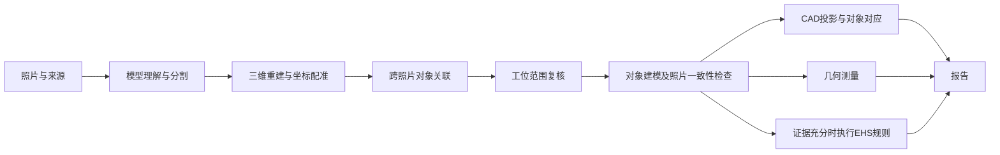

# 算法与分析流程总表

这是 Panoptes Platform 当前照片 → 对象 → CAD / 模型 → 测量 → 报告的统一入口。
维护日期：2026-09-16；代码核对基线：`f790127`。
根 README 中四张照片、七种固定标签的说明属于早期 MVP，不代表当前 Platform 的完整流程。

## 使用与维护规则

- 本表记录代码实际行为；实施计划不等于功能已上线。
- 每个算法必须说明：目的、输入及坐标/单位、方法、关键参数与来源、输出、拒绝条件、局限、代码入口、验证证据、运行阶段/发布状态。
- 参数分成数学定义、工程阈值、产品筛选条件和政策规则。工程阈值不是准确率，不是法规。
- 输出应区分：已测量、没有可靠候选、缺输入、计算失败、尚未处理。不得将后四者归为“没有风险”或“没有该几何”。
- 算法或参数改变，应更新版本和输入指纹，重算受影响结果，同时更新此表；报告读取不得触发整批重建。
- 本目录是说明入口，代码仍是运行参数的唯一执行来源；不另建配置服务或算法注册系统。
- 新流程在这里登记；专项设计、实施计划和验收证据从这里链接，避免散落的计划被误认成现状。

## 流程总览

这是依赖关系图，任务会按变更范围重跑，并非所有任务都会执行每一个阶段。

## 已核对的算法登记

共 12 个功能条目；这是当前主链路的功能分类，不是全仓库算法函数总数。

| ID | 功能 | 方法类型 | 代码入口 | 当前状态 |
|---|---|---|---|---|
| A01 | 图片理解、对象分割 | 模型推断＋输出校验 | `reconstruction.py::run_segmentation`、provider manifest | 已实现；供应商/模型按任务记录，不能用旧 README 推定 |
| A02 | 三维输入、坐标配准 | 模型输出＋确定性几何 | `spatial.py::register_reference`、`registered_frame` | 已实现 |
| A03 | 跨照片对象关联 | 重投影＋阈值＋已确认关系 | `spatial.py::associate_observations` | 已实现；不保证全部身份已核实 |
| A04 | 地面参考估计 | 语义地面证据＋RANSAC | `spatial.py::estimate_native_ground` | 已实现；证据不足时没有地面参考 |
| A05 | 工位内外 sanity check | 多图模型复核＋规则校验 | `reconstruction.py::_review_workcell_scope`、`_admit_workcell_scope` | 已实现；unknown 不强制排除 |
| A06 | 对象模型生成与粗模型 | 生成模型＋受证据约束几何 | `reconstruction.py::run_generation`、`coarse_model.py`、`recgen.py` | 已实现多条生成路径；不等于实测模型 |
| A07 | 模型—照片一致性、姿态优化 | 光线投射＋数值评分与优化 | `model_quality.py::assess_model`、`refine_model_pose` | 已实现；质量状态与位置确认分别保留 |
| A08 | CAD 与照片/模型对应 | 投影几何＋来源关联 | `reconstruction.py::_refresh_plan_projections`、`source_cad.py`、`correspondence.py`、`web/src/CadView.tsx` | 已实现；来源 CAD 与模型投影是不同证据 |
| A09 | 板件自身折弯 | 两个主要平面＋共享边检查 | `scene_measurements.py::fitted_bend` | v2 已发布，仍只检出一处主要折弯 |
| A10 | 地面倾角、两面角、距离、区域占用、选点角 | 确定性几何计算 | `scene_measurements.py::measure_scene`、`web/src/SpatialMeasurements.tsx` | 已有交互计算；多局部面倾角自动批处理未实现 |
| A11 | 分析持久化与报告读取 | 输入指纹、缓存、不可变来源 | `scene_measurements.py::analyze_bends`、`saved_bends`、`publication_site.py` | 折弯批处理/公共报告已验证；独立远程 worker 部署另列 |
| A12 | EHS 规则判定 | 证据适用性＋配置规则＋数值计算 | `policy_engine.py`、`policy_service.py` | 已实现规则路径；当前示例版本尚无新安全评估 |

上表 Python 文件均在 `ehs_spatial/platform/`，除明确标出的前端文件。

### A01 图片理解与分割

输入：照片资产、任务配置、选定 provider；输出：对象候选、像素 mask、来源/调用证据。
模型负责语义与图像推断；代码校验资产、像素域、对象归属等结构。模型版本取任务 manifest，不能以固定类别列表代替。
缺失/无效输出保留失败，不自行补造 mask。遮挡、透明表面和背景混入会影响后续几何。
验证入口：`tests/test_platform_reconstruction.py`、`tests/test_reconstruction_pipeline.py`。

### A02 三维输入与配准

输入：深度/三维点、相机、明确的裁剪缩放映射、背景对应像素；输出：统一坐标变换及配准证据。
`register_reference` 使用有界 RANSAC，默认相对容差 0.02；要求至少 64 个独立支持像素、至少 4 个空间区块。
深度坐标、相机深度和对象局部坐标不能混用；原生尺度不自动转为米。
缺背景支持、退化几何或像素映射不成立时拒绝配准。参数为工程配置。
验证：`tests/test_platform_spatial.py` 的 `register_reference` 用例及 `tests/test_platform_reconstruction.py`。

### A03 跨图关联

输入：mask、相机与同坐标点云、已确认/禁止关联；输出：候选对分数、证据与被接受的关联组。
双向重投影检查深度一致和 mask 包含度，处理遮挡，独立像素计数避免重复采样制造证据。
当前 `AssociationConfig`：支持像素 32、包含比例 0.65、相对深度容差 0.03、最佳差距 0.15、深度一致比例 0.65。
这些是工程阈值。少视角、遮挡、竞争分割可能保留独立记录；名称相同不构成合并证据。
验证：`tests/test_platform_identity.py`、`tests/test_platform_reconstruction.py`。

### A04 地面

输入：明确的地面 mask、多视图三维点和同一坐标系；输出：地面法向、平面与拟合证据。
当前配置：每视图至少 200 点；有多图时至少 2 图；距离阈值为尺度的 0.005；内点比例 0.75；跨视图法向差不超过 5°。
仅用于有来源证据的地面，不把世界 Z 轴直接当作现场竖直方向。
无地面证据、坐标未配准、点分布退化或视图冲突时返回证据不足。
验证：`tests/test_platform_spatial.py` 的地面测试与 `tests/check_scene_measurements.py` 的任意地面法向/缺失地面用例。

### A05 工位范围

输入：当前对象完整清单、每条观察所对应照片、冻结输入指纹；输出：inside / outside / unknown 及边界证据。
`workcell-scope-v2` 调用 model_review，再校验全清单覆盖和每条观察归属。
排除要求目标工位已建立、观察齐全、所有视图均 outside，且有可见边界证据；内部/未知子部件会阻止整组排除。
不按离原点远近或对象大小直接删除。模型可能误识别边界，因此保存原始证据与 unknown。
验证：`tests/test_platform_reconstruction.py`、`tests/test_model_correspondence_audit.py` 中 scope 用例。

### A06 生成模型

输入：对象照片/mask、空间支持、任务选择的生成器与参数；输出：网格、来源、模型姿态及状态。
生成模型与基于观测的粗几何分别保留来源；粗框架建模参数包括 bar_fraction、rung_count，不能把猜测细节称为观测。
`qualify_depth_views` 要求另一张照片中的明确所属观察提供支持；像素容差默认 2，保留被剔除数量及输入哈希。
不能将“有网格”视为“位置正确”。闭塞表面、透明板和视角不足仍可能造成几何错误。
验证：`tests/test_coarse_model.py`、`tests/test_reconstruction_pipeline.py`。

### A07 一致性与优化

输入：当前网格、对象变换、原图 mask 与深度/相机；输出：各视图覆盖、深度误差、质量状态及姿态优化证据。
版本 `observed-model-quality-v1`：最少目标/深度像素各 8；覆盖 0.8；相对深度 P50/P95 上限 0.05/0.15；完整 mask IoU 0.65、precision 0.7。
粗布局检查另有 `coarse-layout-position-v1`：轮廓容差比例 0.05、容差覆盖 0.9、深度内点比例 0.8。
参数为工程门槛，不是标定置信度。优化必须改善且不损害原有证据；来源变化应使旧质量结果失效。
验证：`tests/test_platform_model_quality.py`、`tests/test_platform_quality_binding.py`、`tests/test_capture_model_quality.py`。

### A08 CAD

输入：原始 CAD/来源关联、观测网格或当前网格及其坐标变换；输出：相应投影与对象关联。
投影应来自实际网格/像素域，不用包围盒六边形充当真实轮廓。来源 CAD 不自动成为现场尺度或强制匹配真值。
未对应来源、坐标不一致、缺空间支持须分别显示；投影数量不能代替独立模型数量。
验证：`tests/test_platform_cad_validation.py`、`tests/test_platform_correspondence.py` 和 CAD 前端检查。

### A09 自身折弯

输入：单对象当前姿态下的三角网格；输出：两个拟合面、交线、内角和标注；平展 180°、直角折弯 90°。
版本 `same-mesh-two-surface-interior-bend-v2`。64 个面积分位候选；候选面法向容差 15°、距离容差 0.01×span。
第二面候选法向需偏离第一面超过 20°；两面各占网格面积至少 10%，合计至少 60%；交线要落在两块实际面边缘附近。
双层薄板按各层内部协方差拟合，避免厚度被误当作曲率；仍检查平整度、面积和共享边。
局限：只找一处主要折弯；窄小、多折、圆弧过渡可能漏检。没有可靠结果不等于没有折弯。
验证：`tests/check_scene_measurements.py`（薄板厚度、反绕序、旋转、噪声、断开几何）；
[发布验收](../superpowers/specs/2026-09-16-persisted-bend-analysis.md)。中央板 145.6° 已线上验证。

### A10 其他测量

地面倾角：拟合一个主要面，θ=acos(|面法向·地面法向|)，0° 水平、90° 竖直；偏离竖直=90°−θ。
两面角：两个对象主要面的较小夹角。距离：三角面真实最近距离。区域占用：地面投影交集，不是三维碰撞。
选点角：用户选定的三维线段/竖直参考，依赖实际命中点。输入与输出保留具体对象、资产、坐标系和单位。
当前单网格超过 500,000 三角面拒绝计算；距离算法另有时间上限。倾角缺有效地面会拒绝，绝不换成世界 Z。
当前倾角只在交互调用时计算；自动枚举多个局部面尚未实现。
验证：`tests/check_scene_measurements.py`；前端 `SpatialMeasurements.tsx` 对应模式。

### A11 自动分析与报告

输入绑定对象、representation、asset、pose、coordinate frame、算法版本；输出每对象保存的结果或明确失败状态。
共享 worker 完成场景产物后执行 `analyze_bends`；公共发布准备也执行同一逻辑，为冻结 revision 写独立派生记录。
`bend-analysis-v1` 是 HTTP 结构版本，计算方法当前为 v2，两者含义不同。
公共报告已重算 19 个冻结 revision。当前场景 26 条：3 个有折弯结果、19 个未检出稳定折弯、2 个复杂度限制、2 个非独立模型跳过。
独立 Modal worker 的线上升级仍需已有审核镜像及 DB/storage secret；公共报告已发布不代表独立 worker 已部署。
验证：`tests/check_scene_measurements.py`、`tests/check_publication_site.py`、`tests/check_report_loading.py`。

### A12 EHS

输入：版本化政策、适用性事实、对象与几何证据；输出 PASS / FAIL / NEEDS_REVIEW / INSUFFICIENT_EVIDENCE。
ZEN 处理规则适用性，Python 计算数值事实。政策阈值必须属于具体政策与版本，不从模型外观臆造法规结论。
缺标定、缺有效几何或当前版本没执行评估时，不能展示历史结果为当前合规结论。
验证：`tests/test_policy.py`、`tests/test_policy_compile.py`；当前示例报告仍是“此版本尚未评估”。

## 本次已批准规划的工作

[自动局部平面倾角实施计划](../superpowers/plans/2026-09-16-planar-surface-inclinations.md)。
目标：所有符合面积与平整度条件的局部面自动计算地面倾角；报告筛选非竖直面，可开关标注。
状态：计划已记录，未实现；不将 A09 的折弯内角与 A10 的地面倾角合并为同一含义。

## 方法参考

- [Open3D 多平面检测与 RANSAC](https://www.open3d.org/docs/release/tutorial/geometry/pointcloud.html)
- [PCL 法向/曲率区域生长](https://pointclouds.org/documentation/tutorials/region_growing_segmentation.html)

库同样使用阈值；改进目标是多局部面覆盖、参数有依据、失败可解释，不是取消几何约束。
