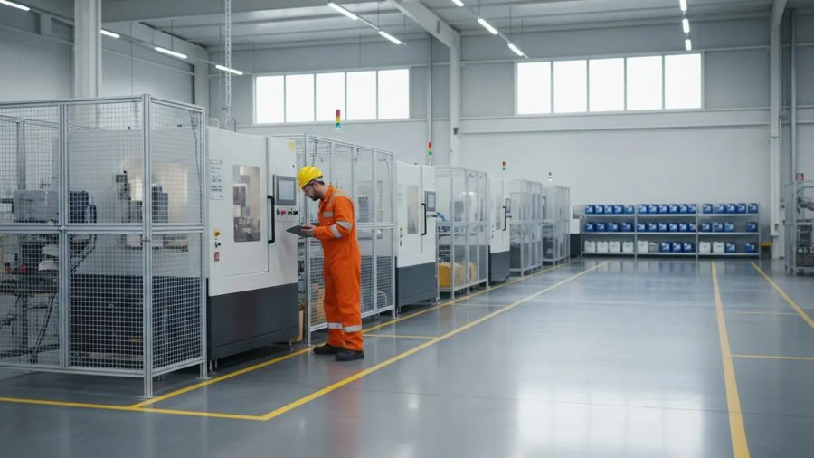
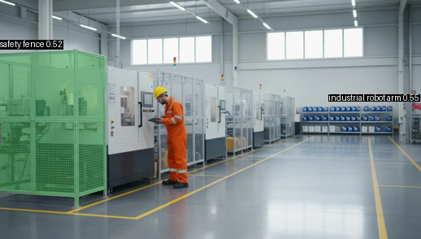
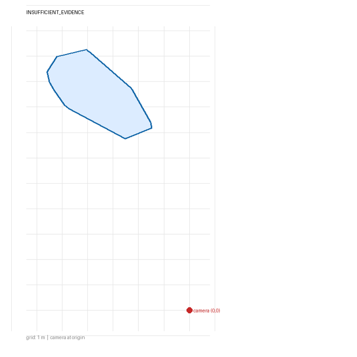
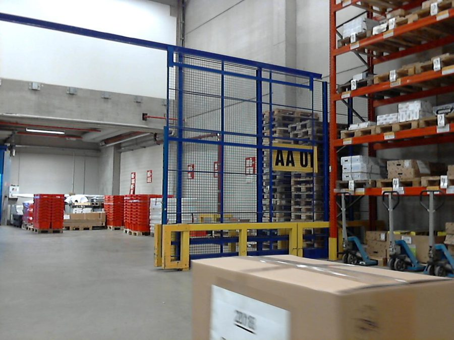
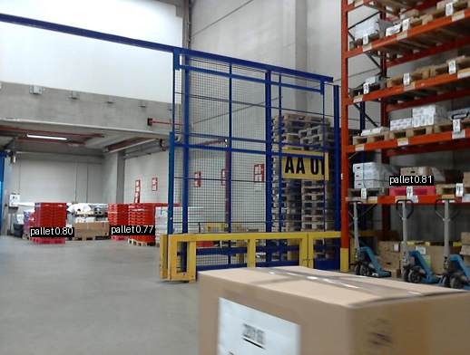
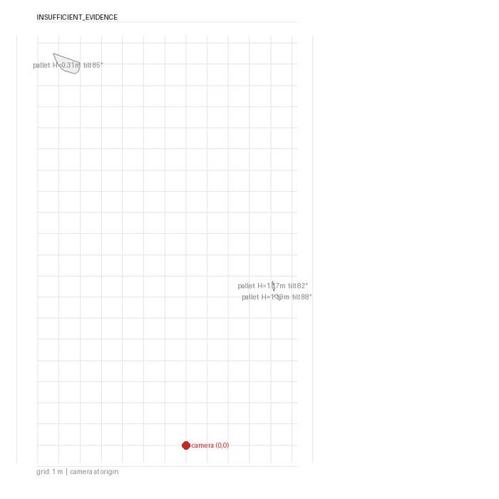

# Photo POC — photos in, audited verdict out (2026-08-25)

Two live runs through the production pipeline (`EHSAssessmentPipeline.run_assessment`),
each from a single photo, with real compiled OSHA-derived policy specs attached.
Every product layer is exercised and lands as a file on disk: geometry, segmentation,
auto scale anchor, deterministic policy verdicts with error bands, evidence overlays,
interactive 3D viewer, measured plan view, provenance manifest, printable report,
History row. Total spend: about **$1** (breakdown at the bottom).

| Run | Input | Verdict story |
|---|---|---|
| `runs/poc-photos-factory` | Owner's real factory photo (robot cells behind mesh guarding) | Honest **INSUFFICIENT** on all three policies — and that is the correct answer |
| `runs/poc-photos-warehouse` | LOCO warehouse photo (CC0, `outputs/datasets/loco`) | **PASS** on pallet max height with measured values; honest abstention on the fence rule |

## How to replay

The Gradio UI does not attach policies to a run yet (`CaptureRun.policies` exists,
the UI never sets it), so the POC drives the pipeline from a script. Save this as
`poc_run.py` anywhere and run it **from the repo root**:

```python
"""Drive the production pipeline with compiled policies attached."""
import json, sys
from pathlib import Path
from ehs_spatial.contracts import CaptureRun, PolicySpec
from ehs_spatial.pipeline import EHSAssessmentPipeline

REPO = Path("/Users/adam/Desktop/Tesla/ehs-spatial")
POLICY_IDS = ("p01", "p05", "p02")   # p02 carries unsupported_reason on purpose

def main() -> None:
    run_id, *images = sys.argv[1:]
    specs = [
        PolicySpec.model_validate(json.loads(
            (REPO / "outputs/policies/compiled" / f"{pid}.json").read_text()))
        for pid in POLICY_IDS
    ]
    capture = CaptureRun(
        run_id=run_id,
        image_paths=[str(Path(p).resolve()) for p in images],
        camera_height_m=1.5,          # fallback only; auto anchor preferred
        scale_preference="auto",
        operator="adam",
        policies=specs,
    )
    assessment = EHSAssessmentPipeline().run_assessment(capture)
    print(assessment.model_dump_json(indent=2))

if __name__ == "__main__":
    main()
```

```bash
# Run A — the flagship (owner's factory photo)
uv run --env-file .env python poc_run.py poc-photos-factory \
    runs/demo-real-factory/input/image_01.png

# Run B — verdict-rich warehouse case (LOCO, CC0)
uv run --env-file .env python poc_run.py poc-photos-warehouse \
    "outputs/datasets/loco/dataset/subset-3/2019-12-17_10/Cam3/1576596029.6918302.jpg"

# Printable report for each run
uv run python -m ehs_spatial.report runs/poc-photos-factory
uv run python -m ehs_spatial.report runs/poc-photos-warehouse

# Browse both runs in the History tab (row per run, disposition panel, verdict card)
uv run --env-file .env python app.py
```

Policy pack used (from `outputs/policies/compiled/`, produced by the OSHA compiler):

- **p01-movable-equipment-clearance** — `min_separation 0.6 m`, movable equipment vs `safety fence`.
- **p05-pallet-max-height** — `max_height 2.5 m` on `pallet`.
- **p02-robot-guarding-separation** — compiled **with `unsupported_reason`**: the
  conditional clause *"while it is enclosed by guarding"* is not expressible in the
  predicate vocabulary, so the engine refuses to evaluate it instead of guessing.
  Attached deliberately so the refusal is visible in the product surface.
- p03/p04/p07/p08 were skipped deliberately: their labels (floor marking, fire
  extinguisher, control panel, storage rack, hard hat, worker) are not in the
  perception vocabulary, so they can only abstain — the same honest outcome p02
  already demonstrates, without spending SAM calls to show it.

## Run A — `poc-photos-factory` (the flagship)



Single photo → MapAnything mono geometry → SAM masks → MoGe auto anchor
(**scale factor 2.294, confidence 0.50** — single-frame anchor is capped at 0.5 by
design) → scene build → policy evaluation → Gemini climb review (REVIEW-only lane).

What perception found, and what the gates did with it:

- `safety fence` — found via the **"fence" synonym** (canonical "safety fence"
  returned nothing on real imagery; the prompt ensemble is load-bearing). The mask
  fragments into 3D clusters; 2 segments merged into one boundary hull (warning
  recorded), 5 fragments discarded by evidence gates (warning recorded). Fragment
  heights 1.8–3.7 m — mesh depth smear inflates some fragments; the real guards
  are 2.2–2.4 m. Single-photo is the screening tier, not the measurement tier.
- `industrial robot arm` — detected, then honestly gated: *"fewer than 20 object
  points above floor"* (the arm is seen through the mesh; too few clean 3D points).
- No movable equipment (cart/pallet/crate/ladder/platform) in the scene — correct;
  there is none. The worker is deliberately not in the perception vocabulary.




Verdict card (exact text the app renders):

> ### INSUFFICIENT_EVIDENCE
>
> Approximate boundary clearance: **unavailable from the evidence**.
>
> **0.6 m demo rule — not an official EHS standard.**
>
> Scale source: `moge_anchor`, confidence 0.50.
>
> **Policies:**
>
> - `INSUFFICIENT_EVIDENCE` p01-movable-equipment-clearance — min_separation 0.6 m — "Movable equipment must be kept at least 0.6 m clear of any machine guarding fence."
> - `INSUFFICIENT_EVIDENCE` p05-pallet-max-height — max_height 2.5 m — "Stacked pallets must not exceed 2.5 m in height."
> - `INSUFFICIENT_EVIDENCE` p02-robot-guarding-separation — min_separation 1.2 m — "No person may stand within 1.2 m of an industrial robot arm while it is enclosed by gua..."
>
> **Warnings:**
>
> - reduced capture (1 view(s) instead of 4): evidence redundancy and cross-view confirmation are weaker
> - observation frame_0001:industrial_robot_arm:0 has fewer than 20 object points above floor
> - 2 safety fence segments merged into a single boundary hull; clearance is measured against the merged hull
> - (+2 more in the structured output)
>
> Climb: **REVIEW only** — UNCERTAIN. climbability remains uncertain because no SceneMap fact was cited.

Why INSUFFICIENT is the *product* here, not a failure: there is no movable
equipment near the guarding, so a 0.6 m clearance rule has nothing to measure.
A system that invented a PASS from that photo would be lying. The refusal on p02
shows the same discipline one layer earlier — at policy compile time.

## Run B — `poc-photos-warehouse` (a real verdict)



LOCO (Logistics Objects in Context, CC0) — staging area with a blue mesh cage
("AA 01"), stillage stacks, racks, pallets. Same script, same policy pack.

- `pallet` — 3 entities passed the gates; measured heights **0.31 m / 1.17 m / 1.19 m**.
- `safety fence` — SAM returned **zero masks for all four prompts** (safety fence,
  fence, barrier, guardrail) on the blue mesh cage. p01 abstains with the warning
  recorded. This is the known real-imagery fence-recall bound, hit live.




Policy outcomes:

- **`PASS` p05-pallet-max-height** — every measured pallet is at most 1.19 m against
  the 2.5 m limit. The mono error band is ±0.35 m; a pallet between 2.15 m and
  2.85 m would have been NEEDS_REVIEW instead — these are all clear of the band, so
  the PASS is honest. Three `max_height` facts with values live in `policies.json`.
- **`INSUFFICIENT_EVIDENCE` p01** — no fence entity in evidence (see above). Not a
  NEEDS_REVIEW, not a guess: no measurement exists.
- **`INSUFFICIENT_EVIDENCE` p02** — same compile-time refusal as Run A.

Honesty notes on this PASS: it covers the pallets perception detected. The tall
pallet stack *inside* the mesh cage was not segmented (occluded behind mesh) and is
therefore not among the measured subjects — the report says what was measured, with
evidence frames per fact, and nothing more. One far-field detection (~17 m) came
back at 0.31 m height, a reminder that mono geometry degrades with distance.

No single-photo FAIL was available honestly in this scene (the one object flagrantly
against the fence is exactly the one SAM could not see through the mesh), so the
verdict-rich story here is the measured PASS plus the documented abstention — not a
shopped-for FAIL.

## Every layer, one file each (both run directories)

| Layer | Artifact |
|---|---|
| Provenance (model pins + git code version + capture tier) | `manifest.json` |
| Raw input copy | `input/` |
| MapAnything geometry + point cloud | `geometry/`, `geometry/point_cloud.glb` |
| SAM observations (label, prompt used, score, mask) | `observations.json`, `geometry/masks/` |
| Scene entities + scale chain + warnings | `scene.json` (`scale_source: moge_anchor`) |
| Policy specs + deterministic results envelope | `policies.json` (`{"specs", "results"}`) |
| Legacy demo-rule assessment + climb review | `assessment.json` |
| Evidence overlays (reviewer-facing masks on photo) | `evidence/frame_0001_overlay.png` |
| Interactive 3D viewer (click-to-isolate, measured dims) | `viewer.html` |
| Measured CAD-style plan view + top-down | `plan_view.png`, `topdown.png`, `cloud_*.png` |
| Semantic point cloud | `geometry/semantic_cloud.ply` |
| Printable report (self-contained HTML, d ± budget) | `report.html` |
| History row + disposition | app History tab (`ArtifactStore.list_runs()`); ruling → `review.json` |

Both runs verified present in `ArtifactStore().list_runs()` (operator `adam`,
capture tier `mono`, worst-policy column populated).

## Spend

| Item | Calls | Est. cost |
|---|---|---|
| fal SAM 3.1 (`image-rle`) — Run A | 11 (first-hit synonym fallback: 2 fence + 1 robot + 8 misses) | ~$0.40 |
| fal SAM 3.1 — Run B | 15 (1 pallet hit + 14 misses incl. 4 fence prompts) | ~$0.55 |
| MapAnything (Replicate, GPU-second) | 2 mono runs | ~$0.02 |
| MoGe-2 anchor (Replicate, pinned version) | 2 | ~$0.05 |
| Gemini climb review | 2 | ~$0.01 |
| **Total** | | **≈ $1.0** (cap was $3) |

## Limitations (read before showing this to anyone)

- **Single-photo error band is ±0.35 m** (screening tier). Metre-valued verdicts
  within the band of a threshold become NEEDS_REVIEW, never a razor-edge PASS/FAIL.
  Multi-view capture tightens the band to ±0.20 m.
- **Vocabulary bounds all verdicts.** 8 perception labels; policies citing anything
  else (worker, floor marking, fire extinguisher, control panel, storage rack, hard
  hat) can only abstain. 21 regulation labels are known-absent — owner decision open.
- **Fence recall on real imagery is prompt-fragile.** The owner's factory mesh was
  recovered only by the "fence" synonym; the LOCO blue mesh cage was missed by all
  four prompts. When the fence is missing, the engine abstains — it never guesses.
- **Far-field mono collapse.** Distant objects (>~10-15 m) come back with unusable
  heights (the 0.31 m "pallet" at ~17 m); gates catch the worst, warnings carry the rest.
- **PASS covers detected entities only** — objects perception cannot see (e.g.
  occluded behind mesh) are not certified by the verdict.
- **Single-frame MoGe anchor confidence is capped at 0.5** by design; the scale
  chain records source + confidence in `scene.json` and on the verdict card.
- **Climb review is REVIEW-only** and cannot alter the deterministic verdict.
