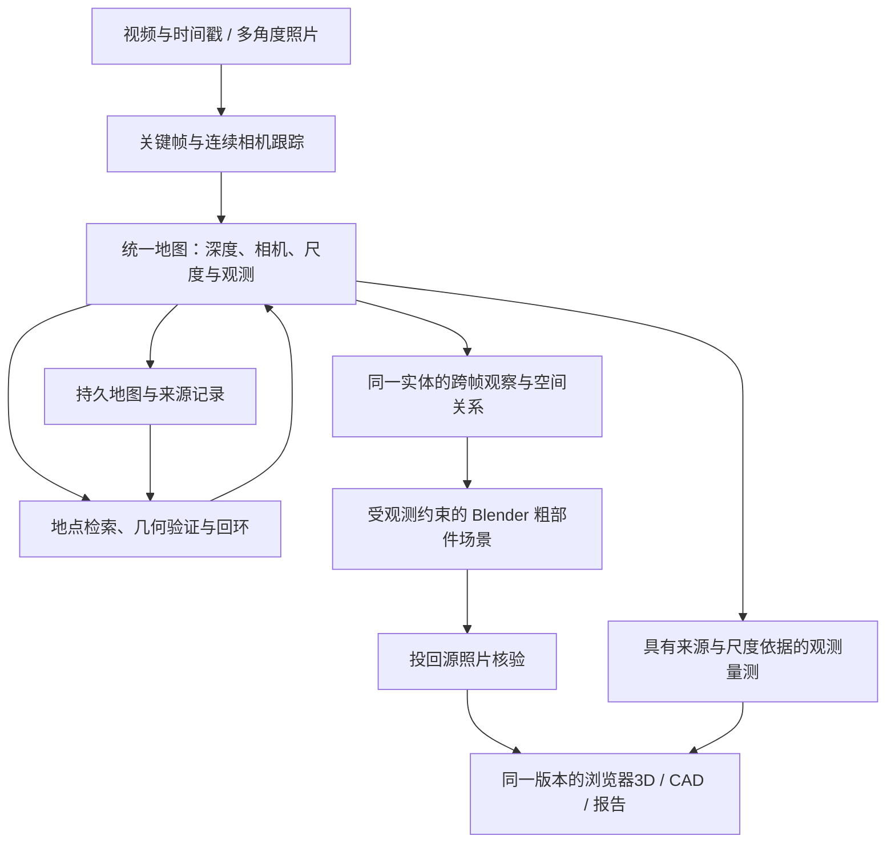

# 工厂视频重建、空间记忆与可编辑场景研究

研究日期：2026-09-17。状态：资料、源码与已有产物核查；没有运行新的重建实验或付费生成，没有更改生产流程。代码基线 `75c278e`。

目标是移动摄像头记录整个空间：从工位 A 经通道走到 B，再返回 A，能够复用同一地图和物体身份，最后在报告中浏览、选择、编辑粗模型并查看 CAD 对应。模型允许简化，位置和来源必须有依据。Nalana 式可编辑建模属于这条链路的表达阶段。

后续实施收敛见[视频到完整场景计划](../algorithms/2026-09-17-video-full-scene-plan.md)：接口复核发现预测深度/局部位姿直接接 RTAB-Map 的尺度与里程计缺口，首个实验改为原生单目 Atlas 保存/重载，再验证稠密几何；下文候选比较保留为研究依据，并非已采用的生产配置。

## 2026-09-17 补充：ConceptGraphs 之后的新候选

本节是论文与公开源码核查，未实跑；不改变已记录的首个持久地图实验，也不表示生产上传已经支持视频。选型需要分别验证连续几何、对象记忆与可编辑形状，不能用某一层的演示代替完整交付。

| 候选 | 新增能力及输入 | 当前可用性与本项目判断 |
|---|---|---|
| [DirectMe / UCS-Bench，ICML 2026](https://github.com/cocowy1/UCS-Bench) | 第一视角视频经深度、位姿、检测与分割构建带时间的对象/位置图，支持空间检索 | 已公开真实帧文件夹入口与存储代码；适合普通视频空间记忆对照。输出图与检索结果，未证明完整可编辑网格或跨会话地图恢复 |
| [DovSG，RA-L 2025](https://github.com/BJHYZJ/DovSG) | RGB-D 扫描、位姿估计、再定位和环境变化后的局部图更新 | 已公开源码与对象/图保存加载；适合研究再次访问和动态更新。预印本始于 2024，不能宣传成 2026 新作 |
| [OP3DSG，2026](https://github.com/AutoCompSysLab/OP3DSG#42-prior-graph-from-self-captured-rgb-d) | 对象、部件、空间/功能关系；3D 入口要求 RGB、米制深度、c2w、K | 已公开检测、融合与图推理脚本；部件点云/图值得复用。仅 RGB 的入口只做 2D 检测，部件节点不代表完成部件 mesh 或铰链恢复 |
| [Hydra++，IROS 2026](https://hydra-plusplus.github.io/) | 层级地图中加入对象级完整 mesh 与轮廓重投影检查 | 最接近“观测地图约束对象模型”的结构；官网明确核心代码待整合发布。不能算现在可直接安装的完整方案 |
| [LingBot-Map，2026](https://github.com/Robbyant/lingbot-map) | 普通视频流预测位姿、深度、点云，保留轨迹上下文 | 已公开代码及权重；是连续几何候选。其轨迹上下文不等于带语义的对象图或跨次地图恢复；[论文限制](https://arxiv.org/html/2604.14141v3#S7)明确没有显式回环检测 |

对照顺序：用同一走动视频比较连续几何，再比较 DirectMe 的视频记忆与 DovSG 的局部更新方法；OP3DSG 用于验证部件层级的增益。以上是候选优先级，不是在当前流水线叠加全部框架。Hydra++ 的地图与对象 mesh 组织可作为设计参考。

速度口径：LingBot-Map [论文表 9](https://arxiv.org/html/2604.14141v3)在 Oxford Spires、518×378、窗口 64/锚点 8 配置报告 H800 20 FPS、RTX 4090 12 FPS。它只说明该配置下几何推理的速度，不包括语义、完整网格、材质、导出及报告，也不是我们的家庭视频验收。当前上传仍为 1–4 张照片，未有家庭视频到完整模型的端到端计时。

同次核查的 [OGScene3D](https://github.com/IRMVLab/OGScene3D) 当前公开内容为 README 与演示；[DGSG-Mind](https://icr-lab.github.io/DGSG-Mind/) 官网未提供核心代码入口，均保留为研究参照。仅依据论文名称、年份或项目页的 Code 按钮不能认定可运行。

## 架构分工：学习模型、几何算法与状态工程

这些方案混合三类工作，不能把“没有训练新的大模型”理解成“只有工程”：学习模型推断深度、特征、分割和形状；几何/关联算法判断坐标、身份、融合与变化；状态工程负责保存、恢复、缓存和执行。回环、跨视角身份与地图融合本身就是算法问题。

按我们的完整空间目标，逻辑链是：视频观测同时进入相机/深度估计与物体/部件识别，随后在共同坐标中投影、关联和融合，累计成带来源的对象地图，再从对象观测恢复网格并回投照片检查，最后供报告、测量和编辑使用。下列项目分别覆盖其中部分，并非每一个都完成整个链路。

| 项目 | 实际架构与算法作用 | 工程作用及边界 |
|---|---|---|
| [LingBot-Map](https://arxiv.org/html/2604.14141v3) | DINOv2 图像特征进入交替的帧内注意力与几何上下文注意力，预测位姿和深度；锚点、近期窗口、压缩轨迹 token 是学习架构的一部分 | 分页 KV cache / FlashInfer 减少重复分配。它的网络历史上下文与可按对象 ID 检索的持久场景图是两种状态；窗口外每帧仍保留少量 token，不能称无限零增长 |
| [DirectMe](https://arxiv.org/html/2606.15200) | 视频几何、检测/跟踪结果投影到世界系，形成物体、地点和时间关系；提问时只检索当时已有的子图与关键帧供 VLM 回答 | 公开代码负责分段执行和图存储；论文检测器与当前仓库默认检测器不同，运行时必须记录实际配置。图保存不等于持久 SLAM 回环或重新定位能力 |
| [DovSG](https://arxiv.org/html/2410.11989v6) | RGB-D 定位后提取对象点云及视觉/文字特征；几何重合和语义相似度加权、贪心关联、点云融合与特征累计；再次访问时定位并局部更新 | 管理对象与图保存/加载及动作流程。关联阈值、体素、聚类和关系规则属于显式算法，仍需要数据验证 |
| [OP3DSG](https://arxiv.org/html/2606.29786) | 对象知识引导部件检测，多视角融合保留小部件，先构造几何关系图，再让 LLM 在约束下细化功能关系 | 管理对象/部件 ID、两阶段产物与数据契约。已知深度/相机是输入，推断功能关系不等于测出机械结构或现场安全属性 |
| [Hydra++](https://hydra-plusplus.github.io/) | 度量语义地图累计对象轨迹，轨迹离开活动窗口时调用 CRISP/SAM3D 补全网格，投影到选定源图比较轮廓，接受后写入层级图 | 分离持续建图和较重的形状生成，管理地图与对象状态。轮廓检查没有替代多视角深度/尺度验证；新增核心代码尚待公开 |

DirectMe 的[位姿传播源码](https://github.com/cocowy1/UCS-Bench/blob/main/directme/mapping/pose_propagation.py)明确将完整回环与位姿图优化排除在范围之外；主流程跨块采用 SE3 串接，未求解跨块尺度。存储旧场景图也没有接通第二段视频的自动重新定位。因此它只进入视频对象记忆的对照，不能直接作为已验证的全屋几何底座。

对本项目的含义：复用现有基础模型与对象/资产契约，但补齐连续地图、跨时间关联与变化更新算法，并把同一版本的坐标、对象几何、CAD/测量和报告贯通。模型补全的不可见表面仍是估计；观测证据必须保留，不能用生成形状反向冒充量测依据。

## 开源接入与是否需要训练

第一版可以不重新训练基础模型，也不采用必须逐场景训练的定位方式：以 ORB-SLAM3 作为持久地图实验，现有预训练几何模型提供稠密观测，参考 ConceptGraphs 的几何/语义关联与对象点云累计，使用已安装的 Open3D 0.19.0 做下采样、融合和表面提取。这里是可验证的模块组合，不是已经集成；普通视频仍需相机标定、统一尺度和坐标的一致性检查。先对整段视频完成轨迹优化再融合，符合上传后处理的目标，可减少首版对持续重积分的要求。

“不训练基础模型”与“所有候选都零训练”不同：[DovSG 官方运行步骤](https://github.com/BJHYZJ/DovSG#32-testing-from-scratch)明确包含针对所扫描场景训练 ACE 重定位模型。地图优化、传感器标定、参数验证也不能因不用训练而省略。源码与权重的具体许可各自核验，本文不把研究可用性当成商业授权。

现有接缝已核查（`75c278e`）：[reconstruction._geometry](../../ehs_spatial/platform/reconstruction.py)接收逐帧 `imageId/points/valid/rgb/K/cameraToWorld/inputToCanonical`；[spatial.unproject_pixels 与 associate_observations](../../ehs_spatial/platform/spatial.py)可复用投影与已有观测关联；`_quality_views` 可将实体所属 mask、深度、相机和来源交给[模型核验](../../ehs_spatial/platform/model_quality.py)。外部模块的对象 ID 必须绑定现有 entity，累计几何和语义特征写回同一记录；回环后的坐标更新必须绑定新的 geometry revision。

实际入口仍需贯通：[Modal process_upload](../../modal_apps/report_workspace_app.py)创建旧流水线，而上述 platform 使用现有 Postgres/blob 服务。只改新模块不能让当前上传自动获得视频能力。[Open3D RGB-D 融合](https://www.open3d.org/docs/release/tutorial/pipelines/rgbd_integration.html)能提取已观测表面 mesh，未观测面及可编辑独立部件还需后续建模与对应核验。

## 结论

这件事有可组合的开源基础。需要同时解决三件不同的事：相机走到了哪里、一路看到的空间和物体如何累计、怎样把这些观测表达成清楚的可编辑场景。单独的视频深度模型、VLM 或 Blender 生成器都不包含完整链路。

几何基础模型与持久地图接口需要分别对照验证；当前首个实验的收敛选择见上方实施计划。已有 Map-Long 可以复用 MapAnything 作为基础模型，RTAB-Map 和 ORB-SLAM3 提供持久化、重定位、跨次扫描与回环参考。保持一套明确的全局坐标责任，几何主干确定后沿用现有对象、来源、Blender、CAD 和报告契约。

三位并行研究员分别核查重建算法、网格及工厂适用性、现有代码；主研究补查 Nalana 本次运行、VGGT 系列、ORB-SLAM3、RTAB-Map 和 ConceptGraphs，并整合下述方案。

## 我们现在是不是单照片

**不是纯单照片：现用入口支持一组 1–4 张照片，一次联合几何推理。** `MapAnythingAdapter.run` 把全部图片放入同一请求；保留每帧点图、内参 K、相机到世界变换 C2W、有效像素和来源映射。见 [adapter](../../ehs_spatial/providers/map_anything.py)、[模型执行](../../modal_apps/mapanything_app.py)、[主流程](../../ehs_spatial/pipeline.py)。

但这仍是局部照片组，不是连续视频地图：

- 现用上传支路 `process_upload → run_upload → EHSAssessmentPipeline → deep_report` 的候选身份仍按单帧 mask 建立，观测表面按照片构建；不能把它与已制作的公开冻结报告、或新 platform worker 混为一谈。
- 新 platform 已有跨照片实体、模型一致性检查和追加配准代码，但独立 Postgres worker 的代码存在不等于上传服务已使用它。
- `register_reference` 要求是同一张旧照片、同一个 hash 在两次重建中的对应点；它不是从新视角认出以前的 A 点。
- 现有视频模块假定摄像头固定，分析人和车辆轨迹；可以复用解码，不能把该轨迹当移动摄像头位姿。
- 在本次审计的 `ehs_spatial`、`panoptes_worker`、`modal_apps` 范围内，未找到地点检索、回环优化或可重载继续定位的 SLAM 地图实现。

因此缺口是**长序列全局一致性、可复用空间记忆、统一表面/实体归属**，而不是简单把照片上传上限改大。

## 算法如何分工

| 路线 | 实际解决什么 | 不能直接当成什么 | 在本项目中的位置 |
|---|---|---|---|
| [MapAnything](https://github.com/facebookresearch/map-anything) | 多图联合相机、深度、三维结构，支持几何先验 | 自带长期地图记忆的完整 SLAM | 最接近已有输入输出的几何基础模型 |
| [VGGT-Long / Map-Long](https://github.com/DengKaiCQ/VGGT-Long) | 分块重建、重叠对齐、回环；已支持 MapAnything | 无限视频的成熟跨会话服务或自动可编辑网格 | 普通 RGB 长序列首个对照候选 |
| [DA3-Streaming](https://github.com/ByteDance-Seed/Depth-Anything-3/blob/main/da3_streaming/README.md) | 长序列深度与相机重建、分块及回环相关实现 | 完整持久 SLAM；所有配置都低于 12GB 显存 | 长序列几何质量/资源对照；指定权重单独审查 |
| [MASt3R-SLAM](https://github.com/rmurai0610/MASt3R-SLAM) | 学习式单目跟踪、稠密地图和回环优化 | 无限制商用库、默认带可编辑表面 | 技术参考；公开许可有非商业条件 |
| [SLAM3R](https://github.com/PKU-VCL-3DV/SLAM3R) | 视频局部点图直接融合到全局点云 | 显式相机轨迹、回环和跨次定位都齐全的 SLAM | 重建对照；不直接承担我们的地图记忆 |
| [WorldMirror2](https://github.com/Tencent-Hunyuan/HY-World-2.0) | 多图/视频预测相机、深度、法线、点云、3DGS | WorldGen 的生成世界/网格宣传不能算真实视频路径产物 | 短片段质量对照；不是当前长途建图首选 |
| [VGGT-Ω](https://github.com/facebookresearch/vggt-omega) | 多帧相机和深度，较省显存的场景推理 | GLB 点云预览不等于三角模型；非商业研究许可 | 跟踪研究，暂不作为产品首选 |
| [COLMAP](https://colmap.github.io/tutorial.html) | SfM 相机、MVS 深度、密集融合和表面重建 | 自动语义身份与持续空间记忆 | 经典离线几何对照，避免无理由重复已有推理 |
| [OpenSpatial](https://github.com/VINHYU/OpenSpatial) | 视频/图像的几何加检测分割，输出场景/物体点云与框 | 已完成三角表面融合、任意工厂语义全覆盖 | 参考其多帧语义处理组织，不整套替换已有系统 |
| [SpatialLM](https://github.com/manycore-research/SpatialLM) | 从点云提取墙门窗和语义布局框 | 完整机器网格；住宅假设不能作为工厂尺寸 | 不作为工厂重建主干 |

上述候选不能只按演示画质排名。WorldMirror2 实际 [video loader](https://github.com/Tencent-Hunyuan/HY-World-2.0/blob/df9988efb87bfc0f4947eb3889411cf957478b06/hyworld2/worldrecon/hyworldmirror/utils/inference_utils.py#L118) 对视频帧数有最多 64 帧的代码上限，pipeline 默认 32 帧；真实重建保存点云、深度/相机及高斯，不能把另一路生成式世界的网格能力移到这里。Map-Long 则专门做重叠分块及回环，但仍需核查持久化和我们工厂数据上的重定位。

许可是选型条件，不是“开源即可接入”：MapAnything 有 Apache 权重版本；DA3 的 nested 权重含非商业条件；MASt3R-SLAM、SLAM3R 公开代码含非商业条件；VGGT-Long 使用 VGGT 自定义许可；WorldMirror2 使用 Hunyuan 自定义许可。不能用基础版的许可与另一版的精度/显存成绩组合成不存在的候选。[MapAnything 模型说明](https://github.com/facebookresearch/map-anything#license)、[DA3 模型卡](https://huggingface.co/depth-anything/DA3NESTED-GIANT-LARGE)、[VGGT-Long 许可](https://github.com/DengKaiCQ/VGGT-Long/blob/main/LICENSE.txt)、[WorldMirror2 许可](https://github.com/Tencent-Hunyuan/HY-World-2.0/blob/main/License.txt)。

## A → B → A：用户说的“记忆”

这里要保存的是可定位的空间证据，而非只有“之前看见过机器人”的文字摘要。

| 能力 | 具体行为 | 可复用的开源参照 |
|---|---|---|
| 连续跟踪 | 相机离开 A、通过通道、到 B，每个关键帧仍落在同一世界系 | [ORB-SLAM3](https://github.com/UZ-SLAMLab/ORB_SLAM3)、Map-Long |
| 地点识别 | 新画面检索曾见过的地点，再用几何验证是否真是 A | [RTAB-Map](https://introlab.github.io/rtabmap/) |
| 回环 | 再次看到 A 后，校正沿途累计误差，避免两份错开的 A | [RTAB-Map 的图优化](https://github.com/introlab/rtabmap/blob/master/corelib/include/rtabmap/core/Rtabmap.h) |
| 跨次扫描 | 保存地图；下一段视频或下次采集重载并继续定位、扩图 | [RTAB-Map 多次建图](https://github.com/introlab/rtabmap/wiki/Kinect-mapping#restartnew-mapping-session)、[ORB-SLAM3 Atlas 保存/载入](https://github.com/UZ-SLAMLab/ORB_SLAM3/blob/master/src/System.cc) |
| 物体及关系记忆 | 同一工位的同一防护栏保留实体 ID；记住它位于哪条通道、哪台机器人旁 | [ConceptGraphs](https://concept-graphs.github.io/)；复用我们现有实体/观测关系 |

**ConceptGraphs 很接近“VLM + 空间记忆”这一部分。** 它从带位姿的 RGB-D 序列，把二维分割和语义融合成物体及关系图，可用于语义检索和定位。它需要上游深度/相机，不替代它们，也不直接生成 Blender 部件。[输入与处理流程](https://github.com/concept-graphs/concept-graphs#prepare-dataset-replica-as-an-example)。

RTAB-Map 的三维建图通常使用 RGB-D、双目或 LiDAR 与里程计；纯 RGB 的外观回环模式不提供完整米制空间。若接普通手机视频，必须补齐一致的深度、相机与位姿，不能把接口存在写成已能直接读取任意 MP4。它的核心为 BSD 许可，所选依赖另核；ORB-SLAM3 支持单目及 Atlas，但要求相机配置，公开版为 GPLv3。[RTAB-Map 输入说明](https://introlab.github.io/rtabmap/)、[纯外观与三维模式](https://github.com/introlab/rtabmap/blob/master/corelib/include/rtabmap/core/Parameters.h)、[ORB-SLAM3 相机配置](https://github.com/UZ-SLAMLab/ORB_SLAM3#4-running-orb-slam3-with-your-camera)。

工程含义：

- 连续走过门口或转弯，画面变化很大也不代表换了一个世界；保留路径和关键帧联系。
- 视频硬剪、完全遮挡或跟踪丢失后，需要重定位证据。关联尚未建立的片段保留其坐标未连接状态，不由 VLM 猜一个相对位置。
- 两个工位都有同款机器人，语义相似不足以合并。地点/物体关联须通过位置、邻接上下文和多视角几何验证。
- 物体移出画面不代表消失；新一次看到物体的位置变化属于新的时刻/状态，不能把移动设备拖影融合到固定地图。
- 回环改动相机后，深度融合、对象姿态、CAD 投影和测量必须随同更新到新 geometry revision；旧模型质量证据失效，应重新检查模型对全部源图的轮廓与深度一致性。只移动相机图标会留下相互冲突的视图。

这些是本项目需要实现/验证的行为，不是现有服务已交付的功能。

## Nalana 这一例能借鉴什么

[Nalana 官网](https://www.nalana.io/) 将产品描述为基于 Blender 的独立建模软件，输出可编辑几何。公开主页没有给出可据此接入的通用服务 API；当前研究不假设可以直接调用其后台。

本次额外读取了用户截图明确显示的本地运行目录：

`/Users/adam/.nalana/scratch-generation-runs/goal-20260917-202255-5afe2e3d/`

| 核查项 | 本次运行记录 |
|---|---|
| 输入 | `request.json` 含三张参考图与“build me this factory”；此例不是单张图实验 |
| 流程 | 参考图理解 → 代码 draft → Blender 执行 → 四个视角渲染/视觉检查 |
| 输出 | `candidates/initial/blender/final.blend` 存在；执行报告保存重开后为 258 个 mesh 对象 |
| 记录耗时 | `stage_events.jsonl` 从 classify 开始到 visual_validation 完成为 81.573 秒；不是完整用户等待时间 |
| 记录调用费用 | `provider_metrics.json` 为 $0.129929、3 次模型调用；只是该例日志成本，不是 Nalana 售价或通用报价 |
| 检查含义 | 视觉自评 8.58/10；报告还列围栏表达等差异；无独立现场尺寸/位置误差证据 |
| 审计边界 | 生成代码未保留；有代码 hash 和执行日志，不能据此复述其私有实现源码 |

截图 UI 的 267 个可编辑对象与执行文件的 258 mesh、几何审计的 247 对象口径不同。它们是建模部件数量，不是 267 个已核实现场实体；不能拿来与我们 26 个业务实体直接比较。

可以采纳的是**照片理解 → 受约束建模 → 渲染检查 → 可编辑交付**的组织方式。我们提供场景世界系、对象中心/占地、主要方向、支撑平面、mask 和相机；建模过程在这些约束下表达围栏、柱、板、设备等部件，最后投回原照片验轮廓与深度。仅做“像照片”的视觉评分不承担定位验收。

生成出的背面、厚度、重复细件等若没有观察依据，保留为建模假设；不能成为现场测角/测距的真值。现场观测足以定位时，不必先做精密封闭网格才允许生成粗部件。

## 最短可验证的产品链路

1. **先建立整空间坐标与观测。** 关键帧覆盖完整路径，不把所有帧当独立照片组。地图优化只由一个选定后端负责；沿用其位姿与地图 artifact，避免 VLM 和多个优化器各自改变布局。
2. **按实体累计观测，再做粗模型。** 离开视野仍保存实体；回到 A 增加同一实体的证据。Blender 场景包含地面、围护、设备及通道关系，用户在一个场景里查看和选择。
3. **复用现有验证与导出。** `model_quality.assess_model`、`refine_model_pose`、`blender_export.export_scene_revision`、对象/照片/模型来源以及 CAD 选择关联已有可复用实现。它们需接入实际运行支路，不能只写新 worker 后宣布上线。
4. **连续表面使用已有 Open3D。** Open3D 库已安装，TSDF 尚未接入现用产品链路。匹配的 RGB、相机 Z 深度、K 与共同世界位姿满足契约时，可用其 TSDF 提取观测三角网格，不需要新增生成模型。[Open3D 官方接口](https://www.open3d.org/docs/release/tutorial/pipelines/rgbd_integration.html)。不能以平滑补面掩盖未观察区域。
5. **保存可重定位数据与版本。** 沿现有 asset/revision 增加视频原帧索引、时间戳、关键帧联系、地图 artifact、变换与误差证据；不另建一套业务数据库。报告读取保存结果，重建和回环更新在处理过程中完成。

## 首轮实验与决策

这是下一步实验设计；本次没有运行，不能给出工厂准确率、完整率或端到端时长承诺。

**普通 RGB 视频先验证 Map-Long/MapAnything 路线，持久地图能力以 RTAB-Map 为重点对照。** 前者与现有几何最接近；后者最直接覆盖 A→B→A 与跨次采集。RTAB-Map 接预测深度/位姿的组合仍是待验证集成，不是现成已通过的配置。DA3-Streaming 留作几何质量对照，WorldMirror2 留作短片段对照；不同时装入生产链。最终依据同一输入实验选一个地图主干。

| 输入/步骤 | 检查目标 | 必须保存的输出 |
|---|---|---|
| 现有三张工位照片 | 用同一证据比较现有模型与约束建模；明确哪些改善来自建模表达 | 多图重投影、各实体位置/朝向、部件/照片/CAD 对应；不当成视频验收 |
| 一段 A→通道→B→A 连续视频 | 走出初始视野后仍有空间联系；返回 A 正确闭环 | 关键帧与轨迹、回环前后残差、A/B 与通道全场景、误配/漏配清单 |
| 另一次从 B 开始、补拍到 A | 地图保存/重载、重定位和增量加入 | 旧实体保持身份、补充观察来源、新/旧地图变换；不重建重复工位 |
| 视频包含短暂遮挡或剪辑跳转 | 区分可重定位与没有关联证据 | 丢失/恢复区间、关联依据、未连接片段；不凭相似设备强连 |
| 预先列出的沿途实体与区域清单 | 覆盖分母固定，区分模型简化与漏掉整个区域 | 逐项记录已建模、已简化、未观测、观测失败及缺口位置；不以返回场景数量代替覆盖率 |
| 原图未参与拟合的复核视角与独立尺寸 | 验证位置与尺度；不只证明内部自洽 | 控制点/长度残差、轮廓和深度偏差、薄板/网孔/透明面例外 |
| 实际报告 | 浏览器完整交付及资源开销 | 首次可交互、旋转/选择/切换、模型和CAD同ID、总耗时及每阶段RAM/VRAM/磁盘 |

重复设备可能造成错误回环；透明/反光面可能给出背景深度；薄杆可能在抽帧、降采样和融合时消失；运动物体破坏静态一致性。这些是工厂输入的验证重点，不是依靠“家庭 demo 看起来完整”即可排除的问题。

精度门槛按实际用途确定。粗模型也要验证空间关系、源图一致性和独立位置/尺度参照；没有独立参照时，只能报告内部一致性，不能宣称位置已验证。需要 EHS 距离/折角结论的局部面，再加严量测精度与误差门槛。保留未观测、未注册和未确认状态，不用一个生成成功率覆盖它们。

## 当前可确认的时间信息

- Nalana 本例记录的处理阶段跨度约 82 秒，只说明三张图的这一次可编辑场景生成。
- 历史 RecGen 单物体的推理、GPU 函数和远程往返是不同数字，不可乘对象数后宣称整空间耗时。
- 当前上传流程尚缺统一的端到端阶段计时。新视频方案需要实测抽帧、定位/回环、深度、关联、建模、验证、导出与浏览器加载；没有测过就不写“几分钟整厂完成”。

## 研究证据附录

本机三份独立审计：

- [算法及公开实现](/Users/adam/Desktop/panoptes-public/research-notes/2026-09-17-video-scene-algorithms.md)
- [网格、工厂差距及详细验收](/Users/adam/Desktop/panoptes-public/research-notes/2026-09-17-factory-mesh-delivery.md)
- [现有调用链与源码位置](/Users/adam/Desktop/panoptes-public/research-notes/2026-09-17-current-scene-pipeline.md)

Nalana 本例原始证据：[输入](/Users/adam/.nalana/scratch-generation-runs/goal-20260917-202255-5afe2e3d/request.json)、[结果](/Users/adam/.nalana/scratch-generation-runs/goal-20260917-202255-5afe2e3d/RESULT.json)、[执行报告](/Users/adam/.nalana/scratch-generation-runs/goal-20260917-202255-5afe2e3d/candidates/initial/blender/execution.json)、[时间线](/Users/adam/.nalana/scratch-generation-runs/goal-20260917-202255-5afe2e3d/stage_events.jsonl)。未复制图片、模型或该软件的私有源码到本仓库。
