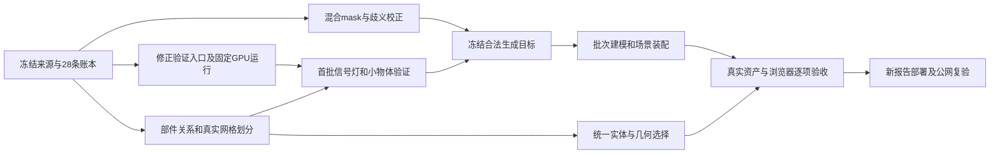

# 工位对象、真实模型与四视图对应 Implementation Plan

> **For agentic workers:** REQUIRED SUB-SKILL: Use superpowers:subagent-driven-development (recommended) or superpowers:executing-plans to implement this plan task-by-task. Steps use checkbox (`- [ ]`) syntax for tracking.

**Goal:** 把当前报告的每条对象记录处理到明确的独立模型、真实模型部件、参考面或有来源的校正结果；照片、场景 3D、CAD、所选对象模型使用同一实体身份，网页内可以看清、选择和修改实际模型。

**Architecture:** 复用现有实体、不可变资产、SAM3D adapter、研究验证入口、任务账本、编辑事务与原生 WebGL。独立对象生成真实网格；确认属于整体的部件从实际网格划分几何所有权，整体和部件不重复渲染。观测 CAD 保留固定来源，模型的数量和加载状态由实际模型链路单独证明。

**Tech Stack:** 现有 Python / Pydantic / NumPy / PostgreSQL、Modal、SAM 3D Objects、React / TypeScript、原生 WebGL、GLB / Blender 导出；复用 pytest 和现有 JavaScript 自检，不新增数据库、队列或渲染引擎。

---

## 1. 执行边界与已查明的原因

本文是实施计划，不表示后续任务已完成。本次仅写计划，没有发起新模型调用或部署。

源码目录：`/Users/adam/Desktop/Tesla/panoptes-platform`，基线 commit `d4edb0b`。下文文件路径相对此目录。Pages 仓库 `/Users/adam/Desktop/panoptes-public/panoptes-workcell-pages` 只接收构建产物。

前面的执行遗漏是：完成了观察证据、CAD、视图尺寸和选择显示修复，却没有把缺少的模型、整体与部件几何绑定完成。继续调整空状态文案不能完成这项任务。

本轮三条审查线交叉确认：

| 已核实事实 | 直接影响 |
| --- | --- |
| 28 条对象记录、84 条观察、3 张照片；只有 9 个当前模型 | CAD 28/28 不等于模型 28/28 |
| 其中 1 条是明确的地面参考面，另 18 条没有当前模型 | 不能把参考地面强制生成为设备，也不能隐藏其余记录 |
| 18 条包含独立物体、整体的板片、混合 mask 和未确定关系 | 不能直接发起 18 次独立物体生成来凑数量 |
| #11 透明护板和 #15 信号灯没有可复用的独立生成网格 | 它们右下角为空有数据原因；不是给渲染器补一个 ID 就能解决 |
| 已有围栏和折叠防护板是完整的单份索引网格，没有命名板片 | 父对象 ID 不能代替真实部件面集合 |
| SAM3D 固定权重访问曾返回 403，当前缺少完整可运行镜像及真实发布证据 | 先定位认证、授权、提交路径和下载问题，不能伪造通过标记 |
| 首次研究验证仍要求 runtime 已通过 | 应修正共享验证门槛中的循环依赖 |
| UI 模型计数来自元数据；单个资产失败后仍可能收到 renderReady | 必须区分声明有模型、下载成功、解码成功和实际可见可选 |

本次不重做网站信息架构、不建设新的 Policy 工作台、不切换模型路线。保留左侧对象、中央四视图、右侧细节/判定/反馈的结构。Blender 是同一模型的导出结果；主要验收地点是网页。

## 2. 冻结基线与对象处理账本

```text
publicationId = 5cf6429b-8ccd-4ab3-8153-fde364bf4b5b
revisionId    = e211fcc8-ab63-4832-9fcc-b1604418d0e0
projectId     = a2b7c04d-0162-488b-b7db-37711a37ea62
frameId       = 087588e9-61f3-5cf4-82e3-849b1b23a416
document      = .platform/model-delivery-20260915/document.json
photo1        = 97d7c64f-dd4b-4d72-a5a7-128d2d75a095
photo2        = 09b3b8ab-a541-4f88-ac22-94723d2f4938
photo3        = 6d69d290-2cea-410b-8c96-73b377ff5917
scale         = uncalibrated（原生单位，不能写成米）
```

当前 9 个模型是 7 个生成模型和 2 个参数圆柱。原始资产全部保留；部件划分产生派生资产，不覆盖原文件。表中“候选”不是已经批准的物理关系，实施时必须核对保存的 identity decision、Observation 修订和原图。

原始文档实际有 34 个 entity 节点：其中 28 条是上述用户对象记录，另外 6 个已经明确标为 `sourceContext:true`，用于补充观测区域、点云和 Capture 背景。这 6 个不计入物体建模目标，但它们的资产与来源同样必须保留和检查；不能临时给缺模型的对象加 sourceContext 来减少分母。它们的固定 ID 为 `ad4a5029-1191-56a9-bc84-487811138837`、`9805a4ae-4942-5b88-9080-cba8b88393c2`、`edd2d2e0-f11a-5398-b87a-903f9d0c34ea`、`7355c397-b0d3-5658-8809-80d6fa8008b7`、`600548f2-46a1-54cd-b6f0-970a526f0abd`、`09823718-a1b2-508a-95a0-b48a0e054399`。

| 编号 / 实体 ID | 当前记录 | 本次处理及完成依据 |
| --- | --- | --- |
| 01 `27d00998-2702-547e-97b2-d200cd92264a` | 左防撞柱 | 保留参数模型；验证照片、模型、变换和拾取 |
| 02 `da0a50da-6459-5471-b25b-d299129c354a` | 右防撞柱 | 保留参数模型；验证照片、模型、变换和拾取 |
| 03 `ce9516a5-a385-5ecb-b6f5-3d543f3ec941` | 右侧完整围栏 | 保留源网格；核对 11/13 的部件关系并划分实际三角面 |
| 04 `d5780205-5e83-5f09-8e90-fe5450d96315` | 工业机器人 | 保留模型；作为非对称、姿态转换验证的现有对照 |
| 05 `929b5b7e-17cb-5e05-bbf9-7767114ddd1e` | 左侧完整围栏 | 保留模型；先解决与 28 的关系 |
| 06 `a719e41c-bc9f-5963-b9f8-2caa031a8c09` | 0001 B 载料小车 | 保留模型；参与 21 混合 mask 校正，不吞并防护板 |
| 07 `0bc9608d-041f-516b-892d-cee0eb174aeb` | 黄黑折叠防护板 | 保留源网格；核对 22/24/25 并划分中央和两侧实际板片 |
| 08 `5163a9b0-0bb6-5bb5-a9bc-927cb94f8d08` | 左黄色光幕立柱 | 保留模型；验证与按钮、围栏的选择边界 |
| 09 `169518d8-4f3a-5f67-a565-3180539acad3` | 右黄色光幕立柱 | 保留模型；验证与按钮、围栏的选择边界 |
| 10 `ed46d9e5-8146-567b-9253-2a554046e144` | 混凝土地面 | 明确参考面；保留来源和选择，不生成设备模型或设备姿态轴 |
| 11 `7b9004a8-5314-524b-976a-bf645e6597f8` | 右围栏上部透明护板 | 03 的部件候选；确认后独立面集合、拾取和预览 |
| 12 `d22e72d1-ca73-5ea4-a5f3-68057d7af6dd` | 相邻工位围栏板 | 独立模型候选；两条观察已关联，生成前解决与 23 的关系 |
| 13 `33188399-aa51-5e81-9d46-8f22ff399b93` | 右围栏下部透明护板 | 03 的部件候选；不能与 11 因同属围栏而合成一条 |
| 14 `0f73b37a-d2e4-5819-8390-c959e0cfe29f` | 右后围栏局部 | 核对独立板或整体局部；没有关系证据不能生成重复板 |
| 15 `f0e43dd1-735c-577a-a9db-67e24c93616e` | 右上信号灯 | 独立生成首批目标；4 条观察，核对灯罩、底座、支架 |
| 16 `33e5c934-cbae-5053-9b71-8c7bf63a072c` | 控制按钮 | 独立小物体目标；保留原分辨率证据，验证按钮不会选中光幕/围栏 |
| 17 `a214c225-ba7a-5550-9af8-5bea16c2cfe4` | 机器人附近指示灯 | 独立候选但类型不明、仅 43 支持像素；先改善分割/核对证据，再做形状验证 |
| 18 `7ed570b4-f194-5c53-b374-1cb85a1edb86` | 警告标识 | 独立表面/模型候选；验证内容、位置与其他标牌不同 |
| 19 `9b77a5b8-8eb2-5235-ba09-35678a26f60d` | 工位标识牌 | 独立表面/模型候选；保留文字与安装位置证据 |
| 20 `4f584238-6ce2-5f12-97b2-4429f122b72e` | 地面标线 | 独立可选的表面区域；绑定实际参考表面，不能凭空赋予厚度 |
| 21 `5c16a2fb-44b8-5961-8faa-b2d24d229ffc` | 护板与料车混合区域 | 先修正/拆分 mask，逐观察绑定正确实体；保留旧记录 lineage，不生成混合物 |
| 22 `a98cf4c5-6c84-5b8c-b27b-93fc17e56d3d` | 黄黑中央板片 | 07 的部件候选；依据折缝和条纹边界划分实际几何 |
| 23 `3a875626-ce97-5f04-a3d0-24f207ce6243` | 右外侧铁网局部 | 核对与 12 的关系；遮挡不能当作独立新围栏的证据 |
| 24 `82f289b3-1be2-5afe-8305-5ff3f668ae4a` | 黄黑右侧折板 | 07 的部件候选；独立面集合，不能高亮整块防护板 |
| 25 `965e797a-54db-574a-8ebf-d44452af59d1` | 黄黑左侧折板 | 07 的部件候选；独立面集合，不能高亮整块防护板 |
| 26 `5af975cb-fd5d-5989-8d60-cbf2ba543bfc` | 左上信号灯 | 独立生成目标；与 15 是不同实物，复用类别不复用实体身份 |
| 27 `59b6410a-a3d6-5e4b-86b7-afe1e0c1c1f8` | 左围栏作业海报 | 独立表面/模型候选；绑定正确位置和印刷内容 |
| 28 `5a62a2d3-0216-512d-b384-3eadd69d3e9e` | 左围栏后部局部 | 核对与 05 的关系；决定部件、同一物体局部或独立对象 |

18 条缺口的初始工作分组：9 条独立几何候选、5 条整体部件候选、4 条需要校正/核对。最终物理实体数量由证据决定，不预设必须是 28 个独立网格。

原始 28 条始终是处理账本的固定分母。合并/拆分必须有旧 ID → 新实体/部件的映射及理由。减少实体行数、把对象改成参考面、复制父网格，都不能自动使账本通过。

## 3. 文件责任与并行顺序

| 工作包 | 负责人及文件 | 产物 |
| --- | --- | --- |
| A 基线与逐条处置 | 集成负责人；新增 `scripts/research/audit_model_correspondence.py`，复用 `scripts/research/materialize_identity_review.py` | 输入/资产哈希、28 条处理账本、来源与候选关系 |
| B 模型运行 | 模型工程线；`reconstruction.py`、`spatial.py` 中 Provider/adapter 部分、`panoptes_worker/__main__.py`、`postgres.py` 的 create_job 管理用途限制、`scripts/preflight_sam3d.py`、`modal_apps/platform_models.py`；新增 `scripts/research/validate_sam3d.py`、`containers/sam3d/Dockerfile` | 可执行验证入口、固定镜像、运行和质量证据 |
| C 部件与版本 | 几何工程线；`contracts.py`、`repository.py`、`identity.py`、`spatial.py` 几何部分、`blender_export.py`；新增 `scripts/research/partition_model_parts.py` | 有证据的部件关系、无重复三角面模型、原子编辑 |
| D 四视图验收 | 前端工程线；`web/src/core.ts`、`scene-semantics.ts`、`ReportScene.tsx`、`viewer/native-viewer.ts`、`types.ts`、`generated/api-schema.ts` 和现有 checks | 实际加载状态、父/部件选择、预览及联动 |
| E 批次与发布 | 集成负责人；复用生成任务、`scripts/export_platform_publication.py`、`tests/check_publication_site.py` | 完整新 revision / Publication、公网逐项证据 |

共享文件 `spatial.py` 的修改串行合并，不让两个 worker 同时改同一段。每个 worker 只改明确归属文件，不回滚其他人的改动。A 的清单冻结后 B/C 并行；C 合同固定后 D 接入；E 等模型实际产物和浏览器验收。



## 4. Task A：冻结数据、逐条决定处理方式

**Files:** 新增 `scripts/research/audit_model_correspondence.py`；复用现有身份核对脚本与 `tests/test_platform_identity.py`。所有诊断输出放 `.platform/model-correspondence/`，提交的代码不能包含能力凭证或 HF token。

- [ ] 读取固定 revision，列出每条记录的观察修订、mask/点图/相机资产、当前表示、模型哈希、CAD 来源、身份决定和未决问题；核对真实 blob 内容，不能只检查资产元数据存在。
- [ ] 同时扫描现有 publication catalog 的全部报告引用，按项目、revision、资产哈希去重，区分当前工作版本与历史快照。当前版本的问题进入处置清单；旧快照做完整性检查并保留，不为追求统一数量重写历史或重复付费生成同一输入。
- [ ] 为每条记录保存如下工作账本；它是批次/验收产物，不新建平行实体数据库。

```ts
type Disposition = 'independent' | 'part' | 'reference_surface' | 'correct_observation' | 'unresolved';
type CoverageRow = {
  sourceEntityId: string;
  disposition: Disposition;
  resolvedEntityIds: string[];
  parentEntityId: string | null;
  evidenceRefs: object[];
  reason: string;
  inputSha256: string;
};
```

- [ ] 使用三张原图、已保存 mask 和 identity decision 核对 11/13、22/24/25 的部件候选。`same` 与 `part` 分开，不以同名或二维框包含判定。
- [ ] 校正 21：把混合观察拆到小车/防护板的实际区域；新观察保存 crop → 原图 → canonical 映射，旧观察留在来源中。
- [ ] 核对 14、23、28 的具体关系，并重新检查受影响的 12、03、05。现有照片不足时生成指向具体遮挡处的补证据请求，不全局重跑所有模型，也不把 unresolved 标为完成。
- [ ] 验证所有原始观察有明确保留或被修订的路径；84 条历史观察不能在数据校正中消失。
- [ ] 冻结合法生成输入：实体 ID、观察修订、主视角、mask、点图、有效性、相机、seed、模型/adapter 版本。主视角复用当前 `max(validPixelCount, observationId)`，不是浏览器当前照片。

新增脚本 CLI 合同（实施后执行）：

```bash
.venv/bin/python scripts/research/audit_model_correspondence.py --document .platform/model-delivery-20260915/document.json --output .platform/model-correspondence/baseline.json
.venv/bin/python -m pytest tests/test_platform_identity.py -q
```

最小账本检查必须实际失败于遗漏/重复来源记录：

```python
import json
from pathlib import Path

baseline = json.loads(Path('.platform/model-delivery-20260915/document.json').read_text())
rows = json.loads(Path('.platform/model-correspondence/dispositions.json').read_text())
audit = json.loads(Path('.platform/model-correspondence/baseline.json').read_text())
assert len(rows) == 28
target_ids = {e['id'] for e in baseline['entities'] if not e.get('sourceContext', False)}
assert len(baseline['entities']) == 34 and len(target_ids) == 28
assert {r['sourceEntityId'] for r in rows} == target_ids
assert len({r['sourceEntityId'] for r in rows}) == len(rows)
assert sum(r['disposition'] == 'reference_surface' for r in rows) == 1
assert {a['assetId'] for a in audit['assetChecks']} == {a['id'] for a in baseline['assets']}
assert all(a['expectedSha256'] == a['actualSha256'] for a in audit['assetChecks'])
```

最后两项由脚本对冻结文档和真实存储计算；不使用写死的模型完成数。A 完成后单独提交清单脚本和测试，原始大资产不进 Git。

## 5. Task B：让 SAM3D 真正运行，而不是只让 preflight 变绿

### B1. 复用研究入口，拆开首次运行验证与产品发布

**Files:** `ehs_spatial/platform/reconstruction.py`、`spatial.py`、`postgres.py`、`panoptes_worker/__main__.py`、`scripts/preflight_sam3d.py`；新增薄 CLI `scripts/research/validate_sam3d.py`；测试 `tests/test_sam3d_runtime.py`、`test_sam3d_preflight.py`、`test_platform_reconstruction.py`。

- [ ] 在冻结的研究协议中加入严格的 `purpose: runtime_validation | quality_validation`。产品生成不能通过客户端 config 声明研究用途来降低门槛。
- [ ] `ProviderSpec.validate` 将首次运行验证单独处理：runtime_validation 仍要求真实许可证据、固定源码/镜像/配置、输入哈希和付费 reservation；允许 runtime/quality/位姿验证证据尚未通过。quality_validation 要求 runtime 已实际通过。普通产品生成要求全部发布门槛。
- [ ] 保留 `run_research_stage` → `_Stages.call` → `reserve_model_call` → adapter 路径；研究结果只产生验证资产，不修改场景 head。
- [ ] 现有 worker 增加明确的管理用途 `validate_model` 分支，调用研究入口。当前 JobRequest.kind 是普通字符串，不能假设已有公共允许列表：在共享 `PostgresRepository.create_job` 拒绝此管理用途，覆盖 API 与 Agent 调用；仅管理 CLI 复用现有 admin batch 事务方式创建它。复用 claim/lease/attempt fencing，不创建另一套临时队列。
- [ ] 把研究结果的 `research_only` 作为结果 scope，worker 终态使用合法的 `succeeded/failed/outcome_unknown`，始终 `document=None`。不能直接把 research_only 写入 job 状态枚举。
- [ ] 新 CLI 的 `--prepare` 只冻结协议/输入并验证权限和预算配置，不派发；`--submit` 才以管理身份创建受支持任务，打印 job ID。协议、配置、身份来源写入审计，敏感信息不打印。

共享 create_job 的最小保护放在幂等恢复前，管理 CLI 不走公开项目写入入口：

```python
if body['kind'] == 'validate_model':
    raise PlatformError('admin_job_required', 403)
```

共享门槛的预期行为：

```text
product generation + runtime unverified          -> reject, 0 model calls
quality_validation + runtime unverified          -> reject, 0 model calls
runtime_validation + license missing            -> reject, 0 model calls
runtime_validation + budget missing/insufficient -> reject, 0 model calls
runtime_validation + approved prerequisites      -> reserve once, call once
research result returned                         -> artifacts only, head unchanged
unknown external result + worker restart         -> no second charged call
public create_job(kind=validate_model)            -> reject before enqueue
```

CLI 合同与检查命令：

```bash
.venv/bin/python scripts/research/validate_sam3d.py --protocol .platform/model-correspondence/runtime-protocol.json --prepare
.venv/bin/python -m pytest tests/test_sam3d_runtime.py tests/test_sam3d_preflight.py tests/test_platform_reconstruction.py -q
```

协议除现有 `id/inputHashes/baselineRevision/metricDefinitions/policyThresholds/split` 外，必须固定 purpose、实体 ID、输入资产哈希、每次及总调用上限。计费上限来自已授权配置；准备阶段不能填一个虚构金额来绕过限制。

### B2. 权重授权诊断与可复现镜像

**Files:** `modal_apps/platform_models.py`、现有 `scripts/prepare_sam3d_mesh_source.py`、`modal_apps/sam3d_mesh_only.patch`；新增 `containers/sam3d/Dockerfile`，构建输入来自锁定的官方源码依赖与审计清单。

固定目标：

```text
codeRevision  = f91db411c50efee93d8db7aeb323885650f6f722
modelRevision = 2e73555018d2741ccd486e56c24fac41155a1dc6
model         = facebook/sam-3d-objects
```

- [ ] 用部署将使用的同一身份读取固定 revision 元数据及 `checkpoints/pipeline.yaml`；从真实配置取 mesh checkpoint 路径，再检查该文件。先读取元数据和小配置，不为诊断下载整份权重。
- [ ] 区分无效 token、账户未获批准、token 无仓库权限、提交/文件错误和下载端点问题。记录状态码、错误码、request ID、固定 commit、文件大小和哈希；不写 token 或签名 URL。
- [ ] 只有确认账户未获许可时，交由账户所有者申请/接受协议；不能用替代下载源规避授权。官方安装流程要求获准后认证，运行环境要求 Linux 和至少 32 GB 显存：[官方 setup](https://github.com/facebookresearch/sam-3d-objects/blob/main/doc/setup.md)。
- [ ] 构建固定镜像：锁定基础镜像 digest，按固定 upstream 依赖安装，运行现有源码准备脚本，记录 receipt 与被改文件哈希，审计完整导入链和 mesh-only 依赖许可。
- [ ] 权重下载到私有模型缓存，保存确切权重哈希；运行镜像/运行清单固定它们，不将受限权重打进公开 Pages 资产。
- [ ] 验证 Gaussian 路径与内部 depth 不会被偷偷执行；预检只报告配置状态，不自动写入“质量通过”。
- [ ] 初次运行使用单容器、无自动推理重试、明确超时与最大调用数；远程构建和下载也保存费用记录。预算检查覆盖这些支出，不能把模型 reservation 当作全部云账单的硬上限。

现有源码准备及离线检查：

```bash
python scripts/prepare_sam3d_mesh_source.py
python -m pytest tests/test_sam3d_mesh_source.py -q
```

上述命令在具备审计过的依赖环境内运行。交付 `hf-access.json`、源码 receipt、依赖/权重清单、镜像 digest。镜像能 import、进程退出 0，都不能代替实际推理验收。

### B3. 固定验证样本与发布门槛

- [ ] 第一轮研究调用用现有 #04 作为对照，不替换它的当前模型；只验证外部点图、相机变换、非对称形状和官方姿态合同。
- [ ] 将固定官方姿态结果与 adapter 结果做数值比较；非单位尺度、旋转相机和非方图分别检查。要求矩阵/顶点变换在数值容差内一致，不重复施加模型输出姿态。
- [ ] 接着验证 #15 信号灯和 #16 按钮，覆盖大对象验证不能代表的小物体输入。#11 走部件划分验证，不默认重新生成整面围栏。
- [ ] 每次保存实际网格、材质/颜色、主视角、点图、位姿、深度调用计数、模型请求 ID、时长和费用。原始相机/点图的哈希必须与输入一致。
- [ ] 先冻结评价协议，再跑候选：轮廓重投影、有效深度残差、可见覆盖、完整部件结构分别报告。已有 9 模型和候选在同一修正版评价程序评分；缺少真值的指标填写未测。
- [ ] 数值坐标合同使用实际转换测试的容差；生成质量按类别建立盲看原图/模型的人工通过记录和逐视角指标，不能临时发明一个“通用 IoU 达标即准确”的阈值。只有通过的类别才能进入批量产品生成。
- [ ] 研究缓存含协议哈希；不承诺验证输出会被产品任务自动免费复用。若采用研究资产，必须走显式接纳并保存其原始来源、发布证据和结果哈希，不能伪装成另一次产品调用。

## 6. Task C：建立真实部件对应，避免重复模型

### C1. 最小领域合同

**Files:** `contracts.py`、`repository.py`、`identity.py`、`spatial.py`，前端生成 DTO；扩展 `tests/test_platform_identity.py` 和 `tests/test_platform_spatial.py`。

- [ ] 在 Entity 增加明确的可空 `parentEntityId`；它只表达已核对的物理组成关系。继续使用 `activeModelRepresentationId/currentModelTransform`；不把用于共同移动的 `groupId` 改成隐含父子关系。
- [ ] 新关系通过已有编辑事务中的显式操作保存，要求基础版本、目标 parent、child 及观察修订证据。允许清除错误关系，但必须留下 lineage 和逆操作。

```json
{
  "type": "setPartRelation",
  "entityId": "7b9004a8-5314-524b-976a-bf645e6597f8",
  "parentEntityId": "ce9516a5-a385-5ecb-b6f5-3d543f3ec941",
  "evidenceRefs": [],
  "reason": "右围栏上部插板；应用前必须附上实际观察修订证据"
}
```

上例空 evidenceRefs 是拒绝用例，不能提交成功。真实提案从 A 的已核对记录生成引用，不手写虚假证据。

- [ ] 共享验证拒绝：自身作 parent、环、跨项目、缺失/退役实体、无证据、模型无共同合法坐标系。merge/split 必须重映射或明确解除受影响关系，不静默悬空。
- [ ] 使用当前场景合同的明确字段扩展，新 revision 写入完整关系与 reader 版本；旧 Publication 及文档不原地补字段。通用调用者通过共享模型族解析处理，不逐页面猜测旧数据。
- [ ] Python 在 `spatial.py`、TypeScript 在 `core.ts` 各提供一次 `modelFamily(document, entityId)` 的语义实现：返回目标实体及递归子实体；两边使用同一份 JSON 样例验证成员一致。场景绘制仍遍历每份 active 几何一次，不对每个父对象再额外绘制族集合。

### C2. 使用现有网格格式划分部件

**Files:** 新增 `scripts/research/partition_model_parts.py`；几何操作复用 `spatial.py`，接纳复用资产注册和编辑事务。

- [ ] 读取 03/07 的实际索引网格与原始颜色/纹理；先验证其当前姿态与来源照片对齐，再从可见 mask、深度遮挡和网格连接关系提出三角面归属。
- [ ] 几何分配只作为提案。无法从可见证据确定的面保留在整体 residual；遮挡背面的归属不能靠最近框猜测。通过照片和实际 3D 板缝检查必要的隐藏面，保存人工修正的具体 face ID。
- [ ] 生成每个确认部件的普通网格文件，以及 parent residual。保留 immutable 源文件，不新增一套前端 submesh 解码格式。
- [ ] manifest 保存源 asset ID/hash、每个 owner 的原 face indices、输出 hash、观察修订、划分方法版本和审查记录。子网格重建索引时同时复制相应顶点属性，不能丢材质或纹理坐标。
- [ ] 接纳时再次验证源 hash 与基础 revision。原完整表示退为历史，子网格与 residual 原子成为当前表示；任何上传失败不提交半个装配。

关键几何检查：

```python
owned = [set(item['sourceFaceIndices']) for item in partition['owners']]
assert all(owned[i].isdisjoint(owned[j]) for i in range(len(owned)) for j in range(i))
assert set().union(*owned) == set(range(source_face_count))
assert sum(len(x) for x in owned) == source_face_count
assert all(part_meshes[eid].face_count > 0 for eid in accepted_part_ids)
# 按 manifest 将局部索引还原，逐面比较源坐标、材质、颜色和世界变换。
```

若源网格没有真实板片，必须返回 `source_geometry_missing`，该部件仍未完成；不能用盒子、凸包或整个父网格代替。按同一 SAM3D 路线补建并验证该部件；接纳时移除实际重复覆盖的父几何，范围冲突没解决不能发布。

父 residual 可以为空：此时 parent 是部件集合，可被选择、预览和整体移动，不制造一个空网格来通过模型计数。

### C3. 保存、变换与导出共用同一几何

- [ ] 各成员仍保存当前原生坐标系中的绝对 TRS；父集合移动使用 `D = M_new_parent × inverse(M_old_parent)`，一次编辑批次对每个成员计算 `M_new_member = D × M_old_member`。
- [ ] 父无 residual 时仍保存集合的编辑基准 transform；它不能被再次乘到已为绝对姿态的孩子上。子部件单独移动只改该部件。
- [ ] TRS 分解后做重组数值检查；非均匀整体缩放造成 shear 时明确拒绝该操作，不悄悄近似。现有单物体非均匀缩放继续可用。
- [ ] 保存一次、撤销一次、重做一次分别产生新版本；变化的几何清除原放置确认。GUI 与 Agent Apply 调用同一编辑服务。
- [ ] 父选择/预览/范围为族并集，子选择仅为其实际几何。前端预览缓存键包含全部成员的 representation/hash/transform，不能只看父变换。
- [ ] `blender_export.py` 与网页遍历相同唯一网格所有权；保留实体/父关系元数据，导出后不重复三角面、不改变世界坐标。

检查命令：

```bash
.venv/bin/python -m pytest tests/test_platform_identity.py tests/test_platform_spatial.py -q
node --experimental-strip-types web/checks/model-view.mjs
node --experimental-strip-types web/checks/renderer-selection.mjs
```

本工作包按“合同与变换”“分区与接纳”分别提交，不能把测试失败留给前端修补。

## 7. Task D：首批真实交付后，按账本完成所有合法目标

**Files:** `reconstruction.py` 中 `run_generation`、`tests/test_object_generation.py`、`tests/test_platform_reconstruction.py`；复用现有任务和模型调用表。

- [ ] 首批交付 #15 独立信号灯、#11 确认后的透明板片、#16 小按钮，全部在网页四视图中跑通。首批仅验证路径，不称作“全部交付”。
- [ ] 生成任务只接收 A 中已核对的显式实体 ID。修正默认 generate_scene 目标推导：排除明确参考面、已完成的当前模型、尚未处置的混合观察；部件按对应任务处理，不能无声重复生成整体。
- [ ] 冻结一批输入后执行现有生成管线，复用完整原生点图/相机。修正 mask 只影响依赖该输入的对象，名称修改、选中对象、刷新页面不触发生成。
- [ ] 对 #12/17/18/19/26/27 等剩余独立候选执行同一生成合同；标牌、海报和标线必须保持真实表面语义，不根据名称猜厚度、标准尺寸或完整背面。
- [ ] #20 标线保留其参考表面和 mask 的实际区域身份；在 3D 中作为该参考表面的可选区域展示，明确区别于生成的独立实体网格。它与地面一起只在其来源坐标系出现，不重复创建悬浮标线实体。
- [ ] #14/21/23/28 的核对结果进入相应独立生成、部件绑定或原实体观察修正步骤；原 ID 到结果的账本映射完整保留。
- [ ] 每个模型分别记录形状验证、放置验证和尺度来源。现有局部姿态优化只在 native-pose 合同通过后使用；尽可能用非主视角检查对齐。生成了网格不能自动调用 confirmPlacement。
- [ ] 固定批次最后装配一个场景版本。实际部分失败返回 incomplete 并列出准确对象及错误；worker 重启不再收费请求结果未知的同一输入。
- [ ] 分支 head 变化时产物保存为独立 revision，不覆盖用户新编辑；重试接纳必须重新核对 base revision 与资产输入哈希。

检查命令：

```bash
.venv/bin/python -m pytest tests/test_object_generation.py tests/test_platform_reconstruction.py -q
```

要新增的关键行为用例：参考面不生成、混合 mask 不生成、部件不重复生成整体、已有 9 份模型输入哈希不变、一次批次只装配一次、取消/迟到结果不推进 head、未知外部结果不重发、失败实体不消失。

## 8. Task E：把实际模型对应接到四视图，而不是只改变状态文字

**Files:** `web/src/core.ts`、`scene-semantics.ts`、`ReportScene.tsx`、`viewer/native-viewer.ts`、DTO；扩展 `web/checks/model-view.mjs`、`renderer-selection.mjs`、`report-scene.mjs`、`cad-view.mjs`。

- [ ] 左侧一份实体/装配清单，部件在整体下面可展开；不在报告下方复制另一份可操作列表。原始来源记录和校正历史保留在细节中。
- [ ] 初始不选对象；选择后照片只强调当前对象 mask/描边，场景 3D 高亮真实成员面，CAD 和右下模型选择同一 entity ID。部件点击不会变成整个父对象。
- [ ] 父选择保留整体及组成部件关系；3D 点击归属明确的板片返回板片 ID，点击 residual 返回 parent ID。遮挡采用真实深度关系，不能为了通过测试全局穿透拾取。
- [ ] 右下显示模型本身和 XYZ，使用已修复的亮度/放大参数。父对象显示全部组成网格；子对象仅显示自己的网格。相机保持，显式“聚焦”才改变主场景镜头。
- [ ] 使用现有 loadProgress/renderReady/loadError 事件报告每个 representation 的实际状态。已下载字节数不代表已上传 GPU；renderReady 表示画布可用，不代表所有对象完整。

事件中的实际资产结果至少包含：

```ts
type ModelLoadResult = {
  entityId: string;
  representationId: string;
  assetId: string | null; // 参数模型没有文件资产
  state: 'loading' | 'ready' | 'error';
  vertexCount: number;
  triangleCount: number;
  errorCode: string | null;
};
```

- [ ] 模型完成率按模型账本，当前浏览加载数按成功 GPU 项计算；两者不能相互替代。详细统计留在检查记录，manager 界面只显示清楚的完成/待处理摘要和当前对象原因，不堆放六套指标。
- [ ] 缺模型、损坏资产、错坐标系分别提示。不得将观测表面改名为生成模型；切换“照片重建证据”是用户明确选择的表示方式。
- [ ] 对象 feedback panel 自动带当前实体/部件、基础版本、照片和模型来源；Agent 使用同一编辑提案，不能在聊天中声称已修改但没有 revision。
- [ ] A → B 快速选择时，A 的迟到资产、预览、加载错误都不能覆盖 B；切语言保持选择、相机和输入。

CAD 必须继续遵守：

1. 观测 CAD 来源与模型列表分离：模型加载失败或从 9 增长到更多，不得减少观测 CAD 对象。
2. 所有原始 CAD 记录、原图和来源哈希保留。来源 CAD 的范围/轮廓作为对应及对齐的约束证据；没有共同坐标变换时，不能强行变成当前米制定位真值。
3. CAD 使用实际轮廓，不能用投影包围盒/六边形替代。当前模型投影用真实网格和当前变换单独标识。
4. 规划移动对象只改变模型投影；来源照片/观测 CAD 不跟着被改写。跨模型模式、三张照片、放大和刷新时，实体映射稳定。
5. 当前固定 28 条账本可以因明确的观察校正形成多个后继映射，但不能随“哪些生成模型加载成功”变化。

检查命令：

```bash
node --experimental-strip-types web/checks/model-view.mjs
node --experimental-strip-types web/checks/renderer-selection.mjs
node --experimental-strip-types web/checks/report-scene.mjs
node --experimental-strip-types web/checks/cad-view.mjs
npm --prefix web run check
npm --prefix web run build
```

## 9. Task F：逐项实际验收、导出与公网发布

**Files:** 复用审计脚本和现有 checks；新增 `web/checks/model-scene-acceptance.html`，使用现有 Vite/WebGL；扩展 `tests/test_platform_spatial.py`、`test_platform_publications.py` 和 `tests/check_publication_site.py`。

- [ ] 审计脚本读取新 revision，下载每个实际模型资产，验证字节数/SHA、有限坐标、有效三角面索引、材质和所有权。某个 assetId 存在但 blob 损坏必须失败。
- [ ] 验收页加载固定真实资产，记录实际解码和 GPU 就绪结果；使用真实三角面拾取，而不是只断言 selection 字段等于 ID。
- [ ] 原始 28 条逐行检查处置结果；独立模型逐个检查，部件逐个检查，参考面/混合记录单独核对。任何 unresolved 保留在未完成清单，不从分母删除。
- [ ] 通过 Computer Use 在真正报告上完成左栏、原图、3D、CAD 四种选择入口，三张照片逐个切换；无该对象证据的照片明确标记不可验证，不制造 mask。
- [ ] 对 #11/#13、#22/#24/#25 验证只高亮对应部件；对父对象验证全部成员并集。遮挡部件通过隔离和适当相机检查，不能用透视拾取冒充可见。
- [ ] 对所有独立模型检查右下自由/正/侧/俯视实际可见像素、亮度、XYZ 和放大；再做 A → B 资产迟到、单资产 404、错误 GLB、WebGL 丢失/恢复检查。
- [ ] 用实际移动、旋转、非单位缩放和部件编辑生成新 revision，下载 GLB；逐网格比较网页与导出的世界顶点、材质、实体/父关系。`.blend` 由同一准备结果生成并重开验证，不能作为网页未验收的替代。
- [ ] 修改场景后旧 EHS evaluation 不自动变成新结论；相关规则重新评估并绑定准确 revision，旧复核不继承。无法测量的项目保留具体缺证据原因。
- [ ] 先验证新 revision/Publication 的所有引用，再构建 Pages 产物和发布新固定报告。保留旧 Publication/资产/读者版本，旧链接可明确进入新报告，不改写旧文档。
- [ ] 生产域名再次逐对象点击并检查资产响应；验证无 localhost/临时供应商导航泄漏。页面重载和看报告不会启动模型任务。

现有发布检查命令：

```bash
.venv/bin/python -m pytest tests/test_platform_spatial.py tests/test_platform_publications.py -q
.venv/bin/python tests/check_publication_site.py --catalog .platform/publication-catalog
```

最终留存产物：

```text
.platform/model-correspondence/baseline.json
.platform/model-correspondence/dispositions.json
.platform/model-correspondence/entity-inputs.json
.platform/model-correspondence/hf-access.json
.platform/model-correspondence/runtime-protocol.json
.platform/model-correspondence/runtime-results.json
.platform/model-correspondence/quality-results.json
.platform/model-correspondence/partitions/
.platform/model-correspondence/coverage-final.json
.platform/model-correspondence/browser-acceptance.json
.platform/model-correspondence/export-comparison.json
.platform/model-correspondence/public-release.json
```

`coverage-final.json` 每条包含原 ID、结果 ID、模型/部件来源、真实三角面数、加载/拾取结果、照片/CAD对应、形状/放置状态及未完成原因。公开交付摘要另存 `docs/platform/MODEL-CORRESPONDENCE-ACCEPTANCE.md`，不公开秘密、完整私有日志或受限权重。

## 10. 完成门槛、执行依赖与停止条件

完成必须同时满足：

- [ ] 原始 28 条记录的处置账本完整；没有无解释丢失或仍未解决的混合/身份问题。
- [ ] 需要独立模型的对象有实际可加载网格；属于整体的部件有真实面归属；地面/标线的参考表面语义明确。
- [ ] 每个可建模目标能在场景 3D 和右下模型看到并选中；不是只有 CAD 编号、状态标签或导出文件。
- [ ] 同一实物没有被重复生成/叠画；父/子选择、保存、撤销、导出一致。
- [ ] 模型计数、实际加载计数、来源 CAD 覆盖、位置确认各有证据，不相互冒充。
- [ ] 三张照片的对应检查通过；现有证据不能确认的位置不伪装现场已验证。若位置尚未解决，该项仍未完成，不宣布完全交付。
- [ ] 原始相机、点图、未标定单位及历史报告保持不变；新 EHS 结论只来自新评估。
- [ ] 公网真实浏览器验收与文件验证均通过，并交付新报告链接和逐项结果。

可以立即并行推进且不依赖新推理：A 清单/核对准备、B1 循环门槛和受限验证入口、C 合同/网格分区准备、D 前端实际加载与选择检查。

付费运行前必须落实实际 HF 读取权限和明确计算总预算/每次预留；当前 403 先由工程诊断，不预先把所有问题交给用户。只有账户未获批准或协议需要所有者接受时才需要账户动作。GPU 时间、失败尝试、构建和存储支出都在预算范围内，不能只限制模型调用数。

先做有上限的运行验证，记录镜像构建、冷启动、推理、上传和实际账单，再估算剩余批次耗时/费用。CUDA 事件时间不等于计费时长，未实测前不承诺总费用或稳定 p95。

如果来源照片确实不能区分某两个实体/部件，补证据请求必须指出具体记录、缺失视角和会影响的决定；这一项不完成不能被标绿。模型许可、实际运行或小物体质量失败时，继续完成不依赖它的工程工作，明确保留对应发布门槛，不能悄悄改用另一条模型路线。

交付顺序固定为：**先完成信号灯、透明板片、按钮的真实联动样例；再完成账本内其余对象；最后全量扫描、保存新版本、公网发布和复验。首批样例通过不是整个任务完成。**
