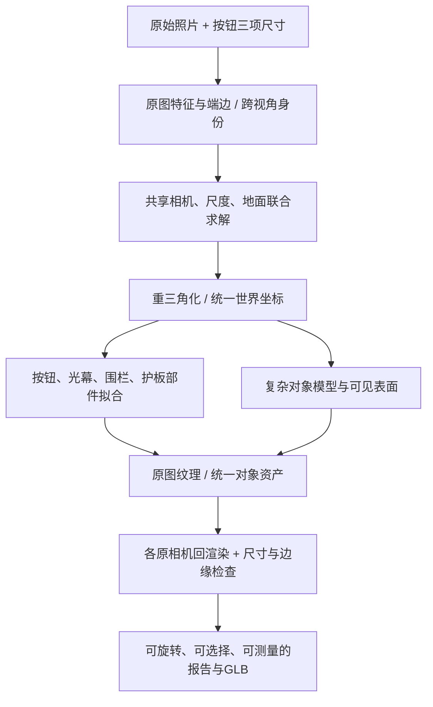

# 从现有 workcell 照片到细节更完整的 real2sim

调研日期：2026-10-01。代码基线：`codex/workcell-photo-speed@d98b468`。本次查论文、官方代码和当前实现，未运行新重建、GPU 推理或新精度实验。

## 结论

适合 Panoptes 的路线是：**共同求解相机与尺度 → 按真实部件结构拟合对象 → 用原始照片补外观 → 导出统一坐标的对象模型 → 回到所有原照片验证。** 复用现有求解器、部件模型和导出器，不需要训练新的基础模型。

当前差距有可定位的实现因素：主链固定预测相机；光幕主要从点云分位数产生包围体；按钮校准失败时仍使用简化比例模型；多数小对象只有可见表面；照片颜色主要以顶点颜色存储。这些步骤没有完整利用原图轮廓、机械结构和高分辨率外观。更多等待时间本身不会改变这些算法。

这也包含输入限制：四张照片没有覆盖的背面、孔洞深度和内部结构不能被验证为真实复原。生成或同规格约束能补完整外形，但必须保留来源。

## 1. 别人实际怎样做

| 项目 | 实际输入与方法 | 可借鉴内容 | 与当前四张照片的区别 |
|---|---|---|---|
| HomeBody | iPhone 视频、D435i 观测、LiDAR/SLAM、机器人状态；实测地图约束布局，ICP 对齐仿真 | 先约束实测几何，再做相同相机的照片/仿真对照 | 有额外深度与测距数据；未公开完整资产生成细节与总重建耗时 |
| RE3SIM | 背景 COLMAP → OpenMVS 网格，同时构建 3DGS；前景对象单独扫描；ArUco 和深度点云用于对齐 | 外观、可编辑对象、碰撞几何分别构建，统一坐标 | 需要额外对象采集与标定；不能把单独扫描的对象质量当成拥挤场景四张照片的直接产物 |
| ROSE | 连续视频；相机/深度、重力校正、对象分割、TRELLIS mesh、尺度与姿态搜索、回渲染筛选 | 对象生成后仍须求尺度/姿态，再投影回输入验证 | 视频实现用 60–300 帧；截至调研未找到公开完整管线 |
| Physics-constrained Real2Sim | RGB-D、相机参数、实例 mask；SAM3D、ICP、接触关系与物理优化 | 检查穿透、接触、支撑关系 | 主要优化刚体姿态和物理参数，不是恢复细小几何；对象稳定不代表测量更准 |

来源：[HomeBody 流程与 FAQ](https://tml.stanford.edu/homebody/)、[HomeBody 发布计划](https://github.com/Stanford-TML/homebody#code-release-schedule)、[RE3SIM 论文](https://re3sim.github.io/re3sim.pdf)、[RE3SIM 代码](https://github.com/InternRobotics/Re3Sim)、[ROSE 项目](https://rose-project-2025.github.io/)、[ROSE 论文](https://openreview.net/pdf?id=VfPdSyJG3v)、[Physics-constrained Real2Sim 论文 v2](https://arxiv.org/html/2602.12633v2)。

### HomeBody：用户展示的效果为什么好

它将视觉细节和 SLAM 实测几何一起提供给 real2sim 构建过程。官方 FAQ 明确区分从视频外观估计尺寸与使用 SLAM 几何约束尺寸。这解释了为什么其结果不能直接作为“四张 RGB + 小按钮标尺”的同条件对照。

截至本次核查，官方仓库计划 10 月 4 日发布 SIM、10 月 11 日发布 REAL2SIM、10 月 18 日发布 REAL，状态均为 Planned。完整资产来源、人工修整量和重建耗时仍未充分公开。[官方仓库](https://github.com/Stanford-TML/homebody)

### RE3SIM：最有价值的是已落地的工程组织

它用照片恢复场景网格，并另建 Gaussian 外观；可交互物体单独获得纹理模型，再接入碰撞、坐标标定和模拟器。公开代码包含 COLMAP、逐场景 3DGS 优化、OpenMVS、对齐和 USD 转换。逐场景拟合不需要重新训练基础模型。[重建脚本](https://github.com/InternRobotics/Re3Sim/blob/master/re3sim/scripts/reconstruct.py)

论文的“约 2.5 分钟”描述人工操作，不是整条重建计算时间；不能拿它承诺我们的端到端延迟。代码默认 3DGS 30,000 次迭代，完整计算耗时需要单独实测。[论文 §IV-E](https://re3sim.github.io/re3sim.pdf)、[默认参数](https://github.com/InternRobotics/Re3Sim/blob/master/re3sim/gaussian_splatting/arguments/__init__.py)

### ROSE 与物理优化：借鉴适用部分

ROSE 的对象生成、尺度/姿态搜索和回渲染检查说明：生成 mesh 后还要解决真实摆放。官网五个任务耗时约 7 分 57 秒至 9 分 22 秒，该表未给硬件；论文实现的连续帧条件与当前照片不同。实机附录另有 RGB-D 采集描述，不能把所有演示统一视为纯 RGB 验证。[项目页](https://rose-project-2025.github.io/)、[论文](https://openreview.net/pdf?id=VfPdSyJG3v)

Physics-constrained Real2Sim 的论文总平均耗时为 22 分钟，SAM3D+ICP 为 10 分钟；正文的 5–20 分钟描述不同对象数量下的优化阶段。其目标是物理一致性。当前公开 CLI 输出 GLB 和 metadata，未接入论文描述的纹理优化入口。我们应借鉴接触检查，准确的光幕底边仍需从照片几何求解。[论文表 I](https://arxiv.org/html/2602.12633v2)、[固定版本主程序](https://github.com/physics-constrained-Real2Sim/physics-constrained-Real2Sim/blob/531a0e56eb3489104e6a9f721feccf3be35c223d/main.py)

## 2. 当前代码具体缺在哪

本节来自当前代码及已有实验记录，不是本次新增实验。

### 相机和尺度

- `scripts/workcell_map_worker.py:34` 保存 MapAnything 的相机、深度和点图。
- `scripts/workcell_button_bundle.py:513` 主链设置 `refine_cameras=False`。
- 已有 `workcell_guard_controls.colmap()`、`limap_control()` 和 `workcell_button_bundle.solve()`，分别支持点 BA、点线 BA、按钮/场景联合拟合；无需另写一套求解系统。
- 三个按钮尺寸已经进入过联合校准实验，验收未通过；不能再说“只要把直径加上就完成”。当前全局尺度仍未获得验证，GLB 仍是 native 单位；当前端点报告中的厘米结果依赖另外明确标注的条件尺度，不能当成全场米制校准。
- 已有实验 180 条轨迹里 169 条仅覆盖两张照片；Photo 2 到 Photo 3/4 只有 5/10 条共同轨迹，Photo 3–4 有 109 条。优化从 100 次增加到 400 次，cost 只下降约 0.60%，留出误差仍大；未知灰底被拉宽至约 17.65 cm。

这些是**连接不平衡、模型形状可能吸收投影误差**的证据；尚不足以证明它们是唯一根因。需要重平衡连接、限制无证据形状自由度的对照实验。[已有实验记录](RGB-DEPTH-EXPERIMENT-2026-10-01.md)

### 对象和细节

当前最终对象清单共 52 条：3 个 RecGen 对象、2 个参数化双片护板、4 个光幕/防撞柱基础形状、3 个围栏结构/地面对象、1 个按钮，以及 39 个可见表面对象。后者包括 25 个地面标记、7 个标识、5 个灯、平台和线槽。标记与标识本来可以是表面；灯等实体则还缺体积和背面。因此数量不能作为完整实体复原率。

| 当前实现 | 对结果的影响 | 现有可复用入口 |
|---|---|---|
| 光幕用照片 4 点云的 2–98 分位数，宽/深另乘 `.85/.3` | 包围体底面与真实端盖、边缘可能不同 | `workcell_photo_oneshot.py:199`；已有原图端边提取与三角化 |
| 按钮保留 `.32/.43/.25` 部件高度比例等显示假设 | 真实圆弧、唇边和部件比例未被充分恢复 | `workcell_photo_objects.py:33`；`workcell_metrology_models.py:15` 已有圆柱、锥台及灰底生成器 |
| 可见表面由相邻预测点连接 | 有正面轮廓，但没有完整实体与厚度 | `ehs_spatial/platform/reconstruction.py:489` |
| 点图为 392×518 | 红帽原图约 48 px，在点图仅约 6 px；边界深度支撑弱 | 原图 crop、像素映射 A 已存在；局部 LoFTR 在 `workcell_guard_dense.py:53` |
| 护板细分后投影采顶点颜色 | 条纹、铭牌等受顶点密度限制 | `workcell_guard_silhouette.py:188`；`blender_export.py:201/281` 已支持 UV、base-color 贴图、材质、层次和相机 |

1036 分辨率也已经试过，相机内参发生明显变化且没有得到受支持的围栏边；全局翻倍分辨率并非已验证改进。

## 3. 精细 real2sim 应怎样接入现有流程

### 第一步：修共享几何约束

复用现有 COLMAP/点线与按钮求解器，优先改善跨照片连接质量，明确三项尺寸各对应哪个物理部位，再检验受限的相机优化是否有效。

1. 同一对象跨视角的特征需要真实匹配，避免把重复栏杆的相邻杆当成同一杆。选择轨迹时同时检查照片图的连通性和空间分布。
   同时核对真实混凝土地面与物理端边的身份。安装底板、导轨曾混入地面样本；平面残差很小也不能证明选中的面就是地面。
2. 按钮高度 10 cm、主体最大直径 8.5 cm、红帽直径 4 cm 作为约束；边缘遮挡、圆弧端点与轴向长度要对应正确。圆形部件的对称性无法独立约束所有方向，仍需场景点线。
3. 相机参数只放开有足够观测支持的自由度，固定坐标规范，避免焦距、距离、尺度与未知形状互相补偿。共享内参需先确认照片来自相同镜头和设置。
4. 相机改变后重三角化边缘与地面，并更新全部对象坐标；不能把新相机和旧点图/旧测量混在一起。

COLMAP 官方也明确指出少图、多参数自标定可能退化，建议选择足够简单的相机模型、合理固定参数，并在相机调整后重建稠密结果。[官方说明](https://colmap.github.io/faq.html#fix-intrinsics)

**为什么一把标尺不自动解决所有尺寸：**参考物能消除全局比例的不确定性，但错误的焦距、相机姿态、局部深度或端点仍会造成形变。按钮尺寸应参与几何约束；只在最后整体乘一个比例无法修复这些误差。

### 第二步：按机械结构恢复关键部件

- **按钮：**复用三部件几何生成器，在已知尺寸下拟合多视角轮廓。真实圆弧、唇边由可见证据或器件图纸确定；不让未测灰底任意变宽来降低重投影误差。
- **光幕：**将壳体、端盖与支架分开识别，从所有可见照片约束壳体真实上下端。最终 mesh 底边、测量端点与物体卡片必须来自同一组参数。它由支架支撑，可以离地，物理一致性不能通过强制壳体落地实现。
- **围栏：**复用已有杆件/框架，拟合真实横梁、立柱和底板；用户关心的“围栏底”需固定为同一根横梁的同一条物理边。
- **VGuard：**沿用三个双片对象及同规格关系；共享夹角是先验，仍需报告其与各照片是否一致，不能把共享值当作独立测量证明。

这一步利用机械结构减少不可辨识的自由度。视图未覆盖的厚度仍需保留推断来源。RecGen 继续作为内部复杂外形候选，并用照片检验其位置、尺度和可见外形。

### 第三步：恢复可见外观细节

先复用已支持的 UV 与贴图导出，把原图投影到受约束的网格；依据可见性、角度、清晰度选择纹理来源，并处理遮挡和接缝。铭牌、黄黑条纹、表面磨损主要由纹理表达；栏杆、端盖、孔口等会改变轮廓或距离的结构需要几何。

OpenMVS 提供成熟的稠密点云、网格、基于多图一致性的网格精化、纹理流程，可作为现有实现的对照；是否加入依赖，应由当前组件的实际缺口决定。[官方流程](https://github.com/cdcseacave/openMVS/blob/develop/docs/pipelines.md)

Gaussian Splatting 能改善视角中的外观，但漂亮的渲染不自动提供可量尺寸的表面。2DGS 等表面方法加入深度与法线约束并支持网格提取，说明 Gaussian 也可用于几何；仍需要相机、尺度、视图覆盖和独立验证。当前最短路径先用已有照片纹理能力。[2DGS 官方方法](https://surfsplatting.github.io/)

### 与模拟器的衔接

当前 GLB/Blender 输出支持可编辑静态几何。真正执行运动与接触时，还需统一米制坐标、对象层次、碰撞体以及实际需要的关节。渲染网格、测量表面和简化碰撞体应保留明确来源与对应关系。静态照片无法唯一确定质量、摩擦和内部机构，这些参数需要规格或动作观测。

## 4. 保持 one-shot，并正确使用并行

目标用户流程是只提交一次照片与标尺，系统自动完成匹配、优化、建模、验证、导出；内部包含多步迭代仍是 one-shot 用户流程。当前自动报告管线已存在，但上述精细几何与验证闭环尚未完成。

- 原图匹配、分割与初始深度中无依赖的工作可并行。
- 共享相机/尺度求解完成后，各对象的部件拟合与复杂模型生成可并行。
- 纹理、回渲染检查可按对象或视图并行；最终统一坐标和导出汇合。
- 重计算沿用临时 `modal run`、2×A100、现有花费 ledger。报告分别记录冷启动、完整端到端与缓存重导出耗时。

本次没有速度测试。现有完整四图运行记录为 366.93 s；提高细节后的耗时尚未测量。外部论文的几分钟、数十分钟对应不同输入和硬件，不能直接作为本项目承诺。[当前运行记录](ONESHOT-CORRECTION-2026-10-01.md)

## 5. 如何确认真的变好

顺序实施三组小对照：**约束修复 → 部件拟合 → 原图纹理**。每次只改变一组因素，复用现有输入与报告。

1. **照片几何：**每张原图的关键点/端边重投影误差；跨视角轮廓；端点身份正确性；记录未支持对象。现有内部交叉验证留出的是某张照片的全部按钮观测，仍使用该照片的场景轨迹定位相机，因此应称“整幅按钮观测留出”，不能称独立整张照片测试。
2. **尺寸：**按钮三尺寸用于标定。已知围栏 20 cm、光幕 24 cm 不输入尺寸拟合目标，用于外部检查；它们已在多轮迭代中被查看，不能称完全独立的盲测。泛化验收需要封存的新尺寸或新场景。
3. **模型一致性：**显示的底边、测量底边和原图可见底边为同一物理边；在原图检查真实混凝土地面的支持像素、排除安装板与导轨，再统一地面和尺度。模型、卡片与下载资产读同一解。
4. **细节覆盖：**分别统计完整实体、可见表面、推断补全部分；地面标记不要求变成立体模型；灯等实体需检查体积与轮廓。
5. **性能：**完整流程墙钟时间、两卡 GPU 时间与实际花费。缓存导出速度单独记录。

当前可接受的结论是“这些方法有可复用实现，现有主链存在可定位的简化”。尚不能声称已达到全场 sub-3 cm、完整物理数字孪生或提高细节后仍维持原耗时。
