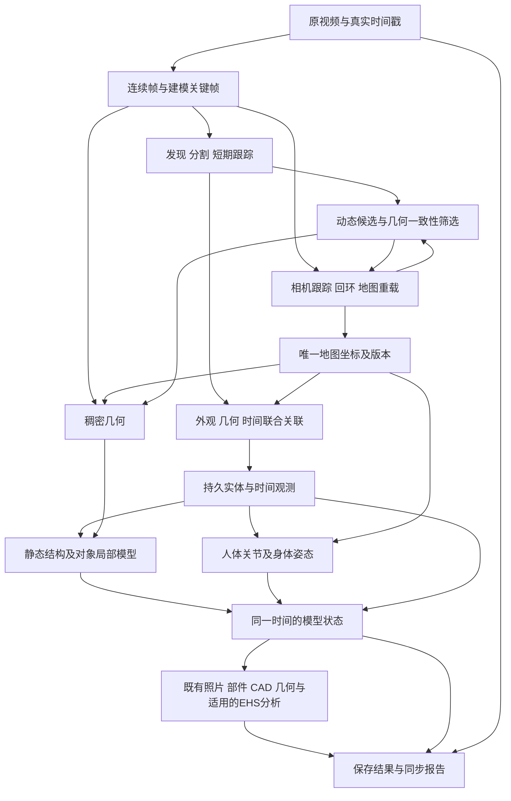

# Phase 2：视频、空间记忆、动态实体与分析模型技术路线

> **For agentic workers:** 实施时按下方里程碑逐项执行，可使用 superpowers:subagent-driven-development 或 superpowers:executing-plans。勾选必须附对应真实输入与验收产物；本文件是技术路线，不是已经完成的实现清单。

**Goal:** 从第一视角视频建立可复用的空间地图，持续关联同一人和物体，按原始时间回放相机、对象及人体姿态，并复用照片分析生成可选择的对象模型、CAD 和有来源的分析结果。

**Architecture:** 一套地图后端管理相机与全局坐标；每个实体保留跨帧观测、可复用几何和随时间变化的状态。现有照片分析与报告消费同一批实体和观测，不另建对象系统；原视频、地图、人体、CAD 和事件共享时间及几何版本。

**Tech Stack:** 首轮验证 ORB-SLAM3/Atlas；复用现有 SAM 3 图片服务、MapAnything、Open3D 和当前 platform；SAM 3 图片发现加已有 SAM2.1 视频记忆已实跑。原生 SAM3/3.1 权重403、现有服务的视频输出是联合mask且无实例ID，故其原生实例视频链仍未验收。人体使用 RTMPose 和已实跑的 SAM 3D Body；跨段外观已测试 OSNet-AIN，不叠加重复的短期 tracker。三维人体参照 WHAM/GVHMR/PromptHMR/DuoMo 的坐标与时间架构，不同时接入所有候选。

更新：2026-09-18。**状态：真实视频回放、SAM3发现/SAM2传播、RTMPose、掩码参与ORB定位、RGB-D稠密点云、照片纹理网格和1123份彩色人物表面已执行，累计168个通过对齐检查的SAM 3D Body关键帧；已加入2条未确认重现候选、6份独立对象表面及既有照片VLM核验；持久身份、普通RGB完整房间及产品上传闭环仍未通过。** 当前实跑证据见 [VIDEO-MVP.md](VIDEO-MVP.md)，下表的里程碑是最终验收要求，不能据单个实验勾选全链完成。 本文件是 Phase 2 当前主路线；[静态建模实施明细](../algorithms/2026-09-17-video-full-scene-plan.md)、[动态表示](DYNAMIC-SCENE.md)、[人体研究](HUMAN-MOTION-RESEARCH.md)、[实际实验](README.md)是其明细与证据。统一入口仍是[算法总表](../algorithms/README.md)。

## 1. 产品需要保存和回放什么

用户案例：某人在 t=0 的视角 1 出现，摄像机转动后，他在 t=4 的视角 2 再出现。要求把两次观测接到同一个实体；如果他走动，保存两个不同位置，而不是把两个身体融合到背景或建成两个人。

第一版完成态必须同时提供：

- **原始经历：** 用原始时间轴回放第一视角视频；选择时间能定位源帧、相机及当时可见对象。虚拟视角来自已建几何，不能据此补造未拍摄的经历。
- **空间记忆：** A→B→A 后记住同一个房间、通道和对象；保存、结束进程、下次加载另一段视频后能通过实际匹配回到旧地图。
- **实体记忆：** 短时轨迹编号可以断开，持久实体身份仍在；对象曾经在哪里、当时是否可见、目前位置是否已知分别保存。
- **人体时间状态：** 同一人的根位置、骨架和身体姿态随时间变化；原地挥手与整个人走动分开表达。
- **模型与分析：** 静态结构和可移动对象有各自可选择的网格/粗模型；现有照片理解、部件、角度、CAD、适用的 EHS 分析仍能使用这些实体及来源。

首个完整验收限制在一个房间、一次连续走动加一次复访、一个人和一个可移动刚体；随后增加两人交叉、车辆、关节设备和相邻房间。这是样本递进，不改变最终所有目标对象均须建模的要求。

## 2. 其他系统的架构与实际特征

这些系统共同使用“视觉特征/观测 → 关联 → 几何估计 → 状态更新”，但各自只解决其中一部分。

| 技术路线 | 输入与提取的特征 | 核心算法及输出 | 对我们有用、但未覆盖的部分 |
|---|---|---|---|
| [ORB-SLAM3](https://github.com/UZ-SLAMLab/ORB_SLAM3) | 连续图像、K；ORB 角点与二进制描述子、地点词袋 | 特征对应、几何位姿、局部/全局优化、地点识别、回环和 Atlas | 提供相机/关键帧/稀疏地图，不提供对象语义、身体姿态或完整表面；单目没有自动可验证的米制尺度 |
| [DROID-SLAM](https://github.com/princeton-vl/DROID-SLAM) | 图像与 K；预训练密集特征、相关体 | 循环更新对应关系与稠密 BA，得到相机和深度 | 已作为独立RGB对照运行1362帧，未与ORB拼接成同一地图。全片Sim3轨迹误差0.04083m，最终高分辨率深度网格仍零散；保存重建文件不等于跨进程旧图重定位。详见[实际记录](VIDEO-MVP.md) |
| [MASt3R-SLAM](https://github.com/rmurai0610/MASt3R-SLAM) | RGB；预训练对应特征与稠密几何 | 相机跟踪、回环、同进程失跟重定位与稠密点图 | 是较新的无标定候选；当前公开入口未核查到保存后重载继续定位，CUDA/非商业许可也与首轮本机路径不同 |
| [ConceptGraphs](https://github.com/concept-graphs/concept-graphs) | RGB、深度、相机位姿；分割区域、CLIP 区域向量、所属 3D 点 | 空间 overlap/IoU 与特征相似度关联，融合对象点云/特征，再组织语义关系 | 借鉴静态对象记忆；[论文](https://concept-graphs.github.io/assets/pdf/2023-ConceptGraphs.pdf)把时间动态列为后续方向，不能直接累计移动人/车的世界点云 |
| [Khronos](https://github.com/MIT-SPARK/Khronos) | RGB-D、语义、里程计与时间；对象/背景分离 | 动态片段重建、场景变化与带时间的场景图 | 借鉴生命周期/历史查询；当前 ROS2 版未稳定。[论文限制](https://arxiv.org/html/2402.13817v2#S7)包括移动后片段关联和完整6DoF配准；保存4D结果不等于RGB相机重定位或持久人车身份 |
| [SAM 3 / SAM 3.1](https://github.com/facebookresearch/sam3) | 文本/视觉提示、共享图像特征、分割记忆；3.1 将多对象跟踪分桶联合计算 | 逐帧发现匹配概念的新实例、分割与会话内跟踪 ID | 已包含短期 tracker；不默认再叠 BoT-SORT。视频 ID 不是跨切镜头/跨次拍摄的持久身份，也不提供骨架或三维地图 |
| [FastReID](https://github.com/JDAI-CV/fast-reid/blob/master/MODEL_ZOO.md) | 人/车裁剪图；对应任务的预训练外观向量 | 历史样本检索、相似度比较 | 可为离场后重关联提供证据；同制服、同款车或外观变化仍可能歧义，不能单独作为身份真值 |
| [RTMPose](https://github.com/open-mmlab/mmpose/tree/main/projects/rtmpose)→人体运动系统 | 人员 crop→关节点；时间窗、相机运动、人体先验 | 2D 骨架，再由人体方法恢复 3D 姿态/身体及根运动 | 需要地图位姿与尺度对齐。[PromptHMR](https://github.com/yufu-wang/PromptHMR)组织多人视频链；[DuoMo](https://github.com/facebookresearch/DuoMo)明确要求移动相机另行提供轨迹 |
| [MapAnything](https://github.com/facebookresearch/map-anything)＋[Open3D](https://www.open3d.org/docs/release/tutorial/pipelines/rgbd_integration.html) | 图像、可选 K/位姿/深度→稠密点图、深度与置信度 | 预训练几何推理，再用已对齐深度融合表面 | 可见表面不等于完整对象；还需分割归属、对象局部融合、部件建模及多图验证 |

**三类特征分别保存，不混成一个“VLM 特征”：** 定位特征回答相机在哪里；对象外观特征帮助判断是不是同一实体；关节/面/边特征描述姿态与形状。VLM 负责候选语义、部件结构和有源帧的解释，不负责凭文字猜三维位姿。所有学习特征记录模型及权重版本、裁剪/mask 与像素域，缓存可复用但不能混用不同编码器的向量。

## 3. 算法、训练、已有能力、工程分工

“已有”只说明下面列明的证据范围；不代表该组件已连接到视频生产入口。第一版没有已知必须由我们重新训练的模块。

| 模块 | 首轮复用算法/能力 | 我们现在的状态 | 必须新增的算法集成或工程 | 是否要新训练 |
|---|---|---|---|---|
| 解码、时间轴 | 现有视频解码与媒体时间 | 859帧原视频与逐帧来源、浏览器同步已实跑；VFR上传尚不支持 | 连续帧/关键帧分工、切镜头边界、持久帧来源、播放器同步 | 否 |
| 相机、回环、地图记忆 | ORB-SLAM3/Atlas；DROID独立RGB对照 | RGB-D全片827位姿通过本样本精度核验；单目A/B跨进程旧点复用有证据，完整房间仍失败。DROID全片1362帧Sim3 ATE 0.04083m，但尺度未标定，也没有地图重载验收 | 运行/标定适配；有效位姿、丢失与地图合并；动态特征筛选 | 否；有几何优化 |
| 稠密几何 | MapAnything＋Open3D | RGB 8/32 帧实跑；32 帧 ATE 0.641 m，质量未通过 | 地图尺度/射线/位姿一致；静态融合与对象局部融合分开 | 否；不做逐场景神经训练 |
| 发现、分割、部件理解 | 现有 VLM、SAM 3 图片 provider；新增 SAM 3.1 视频 predictor | 图片服务及 RLE/来源契约已有，SAM2 本地实验与缓存也保留；不能因视频未接入否认已有 SAM 3 | 原生视频会话与逐帧 mask/ID；新实例发现、漏检/遮挡复核 | 否；调用预训练模型 |
| 短期跟踪与重新出现 | SAM 3.1 原生 tracker；跨段再用预训练外观证据 | 已有SAM3周期发现+SAM2短窗传播；OSNet两条源图支持候选，不强行合并身份 | 会话 ID 命名空间、历史外观样本、短轨迹与持久实体分离；跨段再关联 | 否；人/车若需要 ReID，使用对应预训练权重 |
| 地图实体记忆与运动 | ConceptGraphs 静态关联思路、Khronos 时间表示、现有身份契约 | 已有静态照片重投影关联；新增同地图连续躯干位移，缺口与参考点改变重置 | 相机补偿后的三维运动证据、静止区间、可见性、地图 revision 更新 | 否；这是关联/估计算法加状态工程，不只是存数据库 |
| 骨骼、人体网格 | RTMPose、SAM 3D Body预训练模型 | 真实2D骨架、RGB-D表面及168个人体关键帧已接时间轴；完整身体为模型估计，全片连续覆盖和持久身份仍未验收 | 关节点→持续身份→同一地图；骨架/身体动画读取、遮挡状态 | 首轮否 |
| 刚体/结构/部件模型 | 现有生成、粗模型、Open3D、trimesh、Blender 导出 | 照片模型路径保留；视频已有6份可点击对象观测表面和照片语义，完整形体仍未完成 | 以实体局部坐标合并新视角，补齐粗部件、尺寸/姿态约束及验证 | 首轮否；通用完整建模尚未完成 |
| 照片分析、CAD、几何/EHS | 现有 A01–A12、质量核验、测量持久化 | 照片阶段已有实现与部分发布证据，详见归档；不是本轮重验全部线上流程 | 时间解析共用；同时间模型/CAD/测量；新来源和姿态使旧结论失效 | 否；适用性和数值几何用规则/计算 |
| 回放、保存、报告 | 当前 asset/revision/SceneDocument、浏览器 viewer | 复用原native viewer完成原视频、相机、网格、彩色人物表面/人体网格估计同步；尚未接入产品视频上传 | 原视频 t 同步相机/物体/人体、索引、懒加载、skin/时序渲染 | 否，工程 |

现有房间数字来自[保存的独立评估](README.md)，不能作为人体或动态系统性能。旧人物代码的缺依赖、模拟测试及无法重放的历史记录见[审计](HUMAN-MOTION-RESEARCH.md)。

**不训练不等于不计算。** 特征和深度推理、BA、位姿优化、RANSAC 拟合、数据关联仍需运行；这些几何优化不是训练新的神经网络。第一版不把逐场景 NeRF/3DGS 优化设为前提。只有固定真实验证集证明某一预训练组件持续不适用，才另行讨论针对该组件的数据与微调，当前不启动这条工作。

## 4. 一条共用的处理链

图中的相机与动态筛选是同一时间窗的估计/复核，不是两个互相等待完成的任务：先用人员等动态候选掩码限制特征，几何鲁棒估计相机，再由残差检查其他独立运动区域并重估。保留 mask 的边界和误删静态支持统计。**ORB-SLAM3 原版没有可直接启用的动态 mask 通路**，这一步是真实的特征筛选集成工作。

地图负责唯一全局坐标。人体或深度模型给出的“world”不能直接拼进去；先记录其坐标、尺度及与地图的关系并验证重投影。MapAnything 支持输入位姿，不证明输出严格锁定输入位姿；尤其当前点图与 K+Z 存在误差，不能忽略射线契约继续融合。

### t=0 → t=4 的关联流程

1. t=0 检测到人/车，建立一条观测和短期轨迹，提取 mask/crop、外观特征、相机、可信的三维支持，指向持久 `entity_id`。
2. 连续可见时使用中间帧维持关联；t=0 和 t=4 是用户查看位置，不是只处理这两帧。对象姿态变化与相机姿态变化分别保存。
3. 遮挡/离场使轨迹停止有效观测，但不删除实体及历史外观。t=4 再出现时，检索历史样本，结合外观、时间、几何和竞争候选验证，再接回实体。
4. 静态对象可以用地图位置作强证据；移动的人/车不能要求仍出现在 t=0 的位置。SAM 3.1 会话内 ID 也不足以保证离场后或另一段视频的关联，需额外的持久实体关联。
5. 无重叠切镜头先建立新片段、重新定位相机。身份和地图位置分别判断；无法匹配的片段不沿用上一相机位姿。相同外观且缺乏区分证据时保留候选，不能强行合并。
6. 回放 t=0/t=4 显示同一实体当时的状态。遮挡区间没有观测就保留空档，不能用插值当作真实走过的路径；模型形状可复用，位置与姿态不能照搬最后一次。

关联实现依据：[SAM 3.1 视频状态与输出](https://github.com/facebookresearch/sam3/blob/660a5e9e1b8b4c02c0ad97229b88a09a6e4ff5b7/sam3/model/sam3_multiplex_tracking.py)、[ConceptGraphs 静态关联](https://github.com/concept-graphs/concept-graphs/blob/main/conceptgraph/slam/mapping.py)。持久外观样本引用现有 asset 存储，不新建独立向量数据库；首个房间对象数量可直接计算相似度，扩大规模前先测查询成本。

“移动”依据相机补偿后的对象位置/旋转持续变化及其估计误差；原地挥手还要看关节变化。图像里移动、类别叫车、或刚好某帧静止都不是充分判据。只有单目 RGB 时，遮挡期动态轨迹和绝对尺度可能没有唯一解，身份可关联不等于每一秒的位置都已知。

## 5. 复用现有契约，避免再造一套模型与分析

沿用 `ehs_spatial/platform/contracts.py` 的 `SceneDocument / CoordinateFrame / Camera / Observation / Entity / Representation`。原图资产和 observation 是事实来源，entity 是持久物体，representation 是该物体的几何，revision 是分析版本；**编辑版本时间不等于视频时间**。

| 在现有记录上补什么 | 唯一职责 |
|---|---|
| 捕获帧来源：视频 hash、片段、源帧、原始时间、像素映射 | 通过已有 imageId 找回原视频，不能以抽帧序号替代秒 |
| 地图/相机：地图 revision、每帧位姿有效性、尺度证据 | 所有模型使用相同空间；合并/回环后标记受影响旧结果失效 |
| observation：track 引用、特征引用、可见性、身份依据 | 短期 track 不替换现有 entity_id；重复输入不能重复累计证据 |
| entity/representation 引用不可变时间状态资产 | 存根位姿、关节/形变、状态区间及证据；模型网格主要复用，不逐帧复制整个人/车 |
| 派生分析：时间/区间、模型姿态、地图与输入 hash | CAD、距离、角度、事件和回放取同一时刻、同一资产版本 |

实施时为这些新增字段增加明确类型与校验；现有 DTO 的 extra 透传不是时序支持。影片内使用源媒体相对时间；多个独立视频各自保留时间域，跨片先后依赖可靠采集时间或明确关系，不能仅凭上传顺序制造连续时间。

具体共享入口：`reconstruction.py::run_analysis/run_segmentation/run_generation`、`spatial.py::associate_observations`、`coarse_model.py`、`model_quality.py`、`scene_measurements.py`、`publication_site.py`。原静态跨照片重投影关联只用于满足静态假设的观测；动态对象须结合当时对象位姿转换后再验证。

实际入口仍有工程缺口：完整 platform 编排是 `reconstruction.py::run_capture_pipeline`；既有报告上传走 `process_upload → run_upload → observed_scene.build_observed_scene`，后者主要发布观测表面，CaptureRun 仍有 1–4 张照片约束，不等于已经调用完整建模编排。M5 的视频分支必须将抽取帧、权威相机和已配准几何写入现有 capture/SceneDocument，接通已有 repository/blob/job 和共享分割、生成、质量、CAD 延续处理，不能只把视频交给实验 CLI 后宣称产品已支持。

不能对每批视频帧原样重跑照片 `run_capture_pipeline`：其中 `run_analysis` 会调用照片几何 provider，可能再次创造坐标。应适配现有编排的输入，让视频已验收的地图/几何进入共享下游，不让照片几何覆盖视频地图。照片输入仍走其原有几何来源；两种输入共享实体与建模/分析结果契约。

**已发现的全链路问题必须在时序接入时一起处理：** `web/src/core.ts::planShapes` 对缓存 CAD 投影只接受原姿态或仅平移；旋转物体只更新 3D transform 会使 CAD 轮廓被拒绝。`posed_model/measure_scene` 也读取静态 currentModelTransform。应复用 `_plan_projection` 等几何数学，让三者消费共同的时间状态；不能只让 3D 动起来，留下 CAD 丢物体和测量读旧姿态。人体变形还须使用当时骨架/网格，不以根位置替代身体范围。

## 6. 里程碑和可检查的交付

| 顺序 | 待完成工作及主要落点 | 这一步必须交付 | 通过条件 |
|---|---|---|---|
| M0：验证输入与基线 | 复用 `scripts/reconstruct_room_rgb.py`；在既有 phase2 目录登记源视频、片段、时钟、K、人工身份/可见区间与资源 | 一套固定公开室内数据及人/刚体短片；原视频回放、帧来源；当前失败实验保留 | 视频时间与原图对应；不把带 GT 位姿/框的演示算自动识别；几何/身份容差在运行前按参考数据冻结 |
| M1：持续地图与复访 | 验证 ORB-SLAM3 原版 Atlas；把关键帧/地图 artifact 接到已有相机契约 | A→B→A、保存、退出进程、重载第二段视频的可重放证据；静态可见表面网格 | 通过真实地点匹配回到同一地图；不手填起点或分别对齐两段冒充重定位；失跟有状态，地图尺度独立记录 |
| M2：动态实体与基础时间回放 | `platform/contracts.py`、`identity.py/spatial.py` 的关联；现有 viewer/报告的时间选择；真实动态特征筛选 | 新建首个人/刚体实体及所属观测，建立刚体局部观测几何作姿态参照；持续 ID/可见区间/位姿与原视频相机同步；独立完整模型在 M3/M4 验收 | t=0→t=4 接回正确对象；刚体姿态投影可复核；相似干扰物不被错并；相机转动不被当成物体移动；移动对象不焊入背景或留下重复当前实例 |
| M3：骨骼与身体随时间 | RTMPose 预训练关节；基于通过的身份/地图评估一个 3D 人体方法；在现有 viewer 新增骨架/skin/姿态读取 | 同一人骨架、简单身体与动作回放，保存关节可见性、根轨迹和投影对照 | 走动、原地挥手、坐下、两人交叉可对照；不把髋部相对 XYZ 当地图位置；只有骨架点而无身体模型不能计为人体模型完成 |
| M4：对象建模及既有分析 | 复用 `reconstruction.py/coarse_model.py/model_quality.py/scene_measurements.py`、CAD 与导出 | 完整目标清单中的静态结构、刚体/部件模型；模型源图核验；按有效时间计算的角度/距离及有证据的分析 | 模型允许粗，但身份、位置、主要形状/部件及原图/CAD/3D对应正确；生成背面标明推断；不以一张云/整场景网格冒充逐对象建模 |
| M5：真实输入与报告闭环 | `report_workspace.py`、`modal_apps/report_workspace_app.py`、现有保存/发布与前端 | 从实际入口提交第二个视频/用户家庭视频，处理、重启、读取、回放、继续补充 | 原视频 t、相机、实体、人体、CAD、测量共用一版状态；report 不触发推理，历史与重资产懒加载；无手工修 ID/坐标步骤 |

- [ ] 先执行 M0→M1；人体的预训练源码/环境调研可并行，但不抢先宣称接入完成。
- [ ] M1 通过后执行 M2；照片来源/资产和状态存储可复用，动态关联与地图污染问题须实测。
- [ ] M2 通过后完成 M3，并推进 M4 的静态/刚体建模；二者独立部分可并行。
- [ ] 所有目标输出齐全后完成 M5 的真实用户入口与跨次补拍验收。

Atlas 的特殊验收：源码虽然有 SaveAtlas/LoadAtlas，但加载后会创建新活动图，默认 Relocalization 候选限当前图；跨次复用需要验证后续地点识别/地图合并的实际路径，不能把配置文件存在计为通过。相机子链已完成原生编译与真实运行；共享 ORBextractor 的 mask 通路已接通并验证8层特征/描述子不受禁止像素影响。827组相同RGB-D输入的固定尺度ATE由0.86109m降至0.01531m，独立SciPy复核通过。此结果不代表普通RGB房间重建通过。

源码依据固定于 ORB-SLAM3 `4452a3c4`：[Atlas 加载](https://github.com/UZ-SLAMLab/ORB_SLAM3/blob/4452a3c4ab75b1cde34e5505a36ec3f9edcdc4c4/src/System.cc#L157)、[图像接口](https://github.com/UZ-SLAMLab/ORB_SLAM3/blob/4452a3c4ab75b1cde34e5505a36ec3f9edcdc4c4/src/System.cc#L399)、[特征提取](https://github.com/UZ-SLAMLab/ORB_SLAM3/blob/4452a3c4ab75b1cde34e5505a36ec3f9edcdc4c4/src/ORBextractor.cc#L1086)、[当前图重定位](https://github.com/UZ-SLAMLab/ORB_SLAM3/blob/4452a3c4ab75b1cde34e5505a36ec3f9edcdc4c4/src/Tracking.cc#L3609)、[跨图关联](https://github.com/UZ-SLAMLab/ORB_SLAM3/blob/4452a3c4ab75b1cde34e5505a36ec3f9edcdc4c4/src/LoopClosing.cc#L491)。

实施时每个非平凡逻辑只加必要的可运行检查：复用相机/身份/投影/测量的现有测试位置；新增检查覆盖“相机动而人不动”“相同外观不得强行合并”“重载后同一地图”“旋转后 CAD 不消失”“错时刻不得测距离”。这些检查与真实片段的人工对照都要有；不新建测试框架。

## 7. 算力、存储和实施边界

连续跟踪、地图和人体姿态处理时间状态；深度、VLM 与外形建模用有新覆盖的关键帧。刚体先建立一个模型，再更新 `T_world_object(t)`；身体复用形状并更新根与关节。减少建模帧不能省略快速动作所需的时间观测。

总时间按实际阶段分别计量：解码＋相机/跟踪＋所选关键帧深度/语义＋人体＋融合/模型＋分析/导出；可并行部分用实测调度计算墙钟时间，不直接把模块 FPS 当端到端速度。活动窗口控制推理内存，旧地图/实体按区域读取；持续保存原视频、关键帧与压缩时序，不让浏览器加载全部中间张量。

当前 M2 可复用已经实跑的 MapAnything/SAM2 和 CPU 几何环境；现有云端 SAM 3 图片服务也保留。SAM 3.1 原生视频使用 CUDA；RTMPose 单独验证 CPU/ONNX。DROID、多数完整世界人体链等官方环境也使用 CUDA，不能假定全部能在 M2 跑。实际安装、调用、成本与产物在实验记录中登记，不能由本路线推定已经运行。

公开代码不等于所有权重和身体资产都可用于产品：ORB-SLAM3 GPLv3、人体候选的非商业/自定义条款及 SMPL/MHR 资产在具体接入前作为选型条件核查，详见人体研究。这里只选择技术验证路径，不许诺已有生产依赖组合。

## 8. 路线的逻辑检查

| 用例 | 链路应有的证据 | 不能算完成的结果 |
|---|---|---|
| t=0 看见、t=4 再看见同一车 | 中间可见段/遮挡、两个相机、ReID及候选差异、同一entity的两条时间状态 | 两个独立模型；用同名合并；用旧位置当新位置 |
| 摄像机原地转头，物体不动 | 相机旋转、静态几何一致、对象状态稳定 | 框移动就标为物体移动 |
| 人被挡住后走回画面 | 身份候选、可见性、观测恢复；缺口仍是缺口 | 生成合理动作后声称知道遮挡时发生了什么 |
| 椅子搬到新位置后停下 | 同一模型、前后有效区间、新位置来源 | 背景里留下旧椅子；历史位置永久作为当前占用 |
| 保存地图，另一次从 B 进入 | 加载记录、匹配/地图合并证据、统一坐标与实体 | 保存 PLY 后重新建一张无关联地图 |
| 回环导致地图修正 | 相机、实体位姿、融合资产、CAD、测量/事件共同更新revision | 新3D＋旧CAD/距离混用 |
| 同一对象在不同时间旋转/人体弯腰 | 时间解析后的刚体/关节姿态，CAD与测量使用同一状态 | 只修改3D展示；CAD消失或人体只剩静态包围框 |

当前真实产物已经证明部分链路：短时人物/骨架回放、RGB-D动态特征排除、有限跨进程地图复用。仍没有运行产物证明上述全部用例和普通RGB完整房间已通过。这份路线把可借用的算法、已有资产、必须新增的连接和真实验收分开，后续只按实际证据更新状态。
